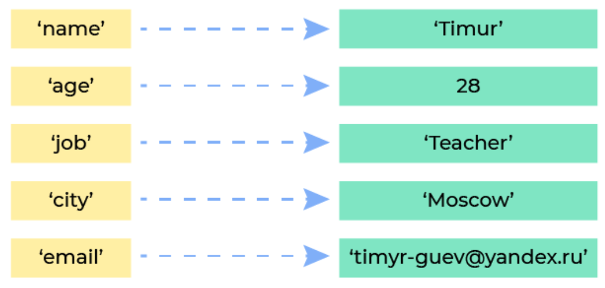

# 10. Словари
---

## 10.1 Введение в словари в Python

*Аннотация. В этом уроке мы начнем изучение словарей в Python, тип данных – dict. Этот тип данных похож на списки и применяется при решении многих задач.*

### Новый тип коллекции

В прошлых уроках мы изучили четыре типа коллекций в Python:

*   списки – изменяемые коллекции элементов, индексируемые;
*   строки – неизменяемые коллекции символов, индексируемые;
*   кортежи – неизменяемые коллекции элементов, индексируемые;
*   множества – изменяемые коллекции уникальных элементов, неиндексируемые.

Следующий тип – словари – изменяемые коллекции элементов с произвольными индексами – ключами. Если в списках элементы индексируются целыми числами, начиная с 0, то в словарях — любыми ключами, в том числе в виде строк.

### Отличия словарей от списков

Как нам уже известно, списки — удобный и самый популярный способ хранения большого количества данных в одной переменной. Списки индексируют все хранящиеся в них элементы, что позволяет быстро обращаться к элементу, зная его индекс.

Приведенный ниже код:

```python
languages = ['Python', 'C#', 'Java', 'C++']

print(languages[0])
print(languages[2])
```

выводит:

```text
Python
Java
```

Допустим, мы хотим хранить имя создателя каждого языка программирования. Это можно сделать несколькими способами.

**Способ 1.** Хранить еще один список, где по соответствующему индексу будет находиться имя создателя языка программирования.

Приведенный ниже код:

```python
languages = ['Python', 'C#', 'Java', 'C++']
creators = ['Гвидо ван Россум', 'Андерс Хейлсберг', 'Джеймс Гослинг', 'Бьёрн Страуструп']

print('Создателем языка', languages[0], 'является', creators[0])
```

выводит:

```text
Создателем языка Python является Гвидо ван Россум
```

Подход рабочий, но хранить данные в двух коллекциях не очень удобно.

**Способ 2.** Хранить список кортежей с парами значений "язык - имя создателя" в каждом.

Приведенный ниже код:

```python
languages = [('Python', 'Гвидо ван Россум'), 
             ('C#', 'Андерс Хейлсберг'), 
             ('Java', 'Джеймс Гослинг'), 
             ('C++', 'Бьёрн Страуструп')]

print('Создателем языка', languages[2][0], 'является', languages[2][1])
```

выводит:

```text
Создателем языка Java является Джеймс Гослинг
```

Тоже рабочий подход, однако не очень эффективный. Придется написать цикл `for` для поиска по всем элементам списка `languages` кортежа, первый элемент которого равен искомому (названию языка). Чтобы найти автора языка C++, нужно будет в цикле пройти мимо Python, C# и Java. Не получится угадать заранее, что язык C++ лежит после них.

Приведенный ниже код:

```python
languages = [('Python', 'Гвидо ван Россум'), 
             ('C#', 'Андерс Хейлсберг'), 
             ('Java', 'Джеймс Гослинг'), 
             ('C++', 'Бьёрн Страуструп')]

for item in languages:
    if item[0] == 'C++':
        print('Создателем языка', item[0], 'является', item[1])
```

выводит:

```text
Создателем языка C++ является Бьёрн Страуструп
```

Списки индексируются целыми числами, но в этом случае удобно было бы находить информацию не по числу, а по строке — названию языка программирования. В списках строки не могут быть индексами, однако в словарях это возможно.

Словарь (тип данных `dict`), как и список, позволяет хранить много данных. В отличие от списка, в словаре для каждого элемента можно произвольно определить «индекс» — ключ, по которому он будет доступен.

> **Словарь** — реализация структуры данных "ассоциативный массив" или "хеш таблица". В других языках аналогичная структура называется map, HashMap, Dictionary.

### Создание словарей

Чтобы создать словарь, нужно перечислить его элементы – пары ключ-значение – через запятую в фигурных скобках, как и элементы множества. Первым указывается ключ, после двоеточия — значение, доступное в словаре по этому ключу.

Приведенный ниже код:

```python
languages = {'Python': 'Гвидо ван Россум', 
             'C#': 'Андерс Хейлсберг', 
             'Java': 'Джеймс Гослинг', 
             'C++': 'Бьёрн Страуструп'}
```

создает словарь, в котором ключом служит строка — название языка программирования, а значением — имя создателя языка.

### Обращение по ключу

Извлечь значение элемента словаря можно, обратившись к нему по его ключу. Чтобы получить значение по заданному ключу, как и в списках, используем квадратные скобки `[]`, индексируем по ключу.

**Способ 3.** Приведенный ниже код:

```python
languages = {'Python': 'Гвидо ван Россум', 
             'C#': 'Андерс Хейлсберг', 
             'Java': 'Джеймс Гослинг', 
             'C++': 'Бьёрн Страуструп'}

print('Создателем языка C# является', languages['C#'])
```

выводит:

```text
Создателем языка C# является Андерс Хейлсберг
```

В отличие от списков, номеров позиций в словарях нет.

Приведенный ниже код:

```python
languages = {'Python': 'Гвидо ван Россум', 
             'C#': 'Андерс Хейлсберг', 
             'Java': 'Джеймс Гослинг', 
             'C++': 'Бьёрн Страуструп'}

print('Создателем языка C# является', languages[1])
```

приводит к возникновению ошибки `KeyError`.

Ошибка `KeyError` возникнет и при попытке извлечь значение по несуществующему ключу. В качестве ключа можно указать выражение: Python вычислит его значение и обратится к искомому элементу.

**Способ 4.** Приведенный ниже код:

```python
languages = {'Python': 'Гвидо ван Россум', 
             'C#': 'Андерс Хейлсберг', 
             'Java': 'Джеймс Гослинг', 
             'C++': 'Бьёрн Страуструп'}

print('Создателем языка C# является', languages['C' + '#'])
```

выводит:

```text
Создателем языка C# является Андерс Хейлсберг
```

### Встроенная функция dict()

Если ключи словаря — строки без каких-либо специальных символов, то для создания словаря можно использовать функцию `dict()`.

Приведенный ниже код:

```python
info = dict(name='Timur', age=28, job='Teacher')
```

создает словарь с тремя элементами, ключами которого служат строки `'name'`, `'age'`, `'job'`, а значениями – `'Timur'`, `28`, `'Teacher'`.

### Создание словарей на основе списков и кортежей

Создавать словари можно на основе списков кортежей или кортежей списков. Первый элемент списка или кортежа станет ключом, второй — значением.

Приведенный ниже код:

```python
info_list = [('name', 'Timur'), ('age', 28), ('job', 'Teacher')]  # список кортежей

info_dict = dict(info_list)  # создаем словарь на основе списка кортежей
```

создает словарь с тремя элементами, где ключи — строки `name`, `age`, `job`, а соответствующие им значения — `'Timur'`, `28`, `'Teacher'`.

Аналогично работает приведенный ниже код:

```python
info_tuple = (['name', 'Timur'], ['age', 28], ['job', 'Teacher'])  # кортеж списков

info_dict = dict(info_tuple)  # создаем словарь на основе кортежа списков
```

Если необходимо создать словарь, каждому ключу которого соответствует одно и то же значение, можно воспользоваться методом `fromkeys()`.

Приведенный ниже код:

```python
dict1 = dict.fromkeys(['name', 'age', 'job'], 'Missed information')
```

создает словарь с тремя элементами, где ключи — строки `'name'`, `'age'`, `'job'`, а соответствующие им значения: `'Missed information'`, `'Missed information'`, `'Missed information'`.

> Если методу `fromkeys()` не передать второй параметр, то по умолчанию присваивается значение `None`.

Приведенный ниже код:

```python
dict1 = dict.fromkeys(['name', 'age', 'job'])
```

создает словарь с тремя элементами, в которых ключи — строки `'name'`, `'age'`, `'job'`, а значения — `None`, `None`, `None`.

### Пустой словарь

Пустой словарь можно создать двумя способами:

*   с помощью пустых фигурных скобок;
*   с помощью функции `dict()`.

Приведенный ниже код:

```python
dict1 = {}
dict2 = dict()


print(dict1)
print(dict2)
print(type(dict1))
print(type(dict2))
```

создает два пустых словаря и выводит:

```text
{}
{}
<class 'dict'>
<class 'dict'>
```

> **Важно:** Вспомните, что создать пустое множество можно, только используя функцию `set()`, потому что пустые фигурные скобки зарезервированы для создания словаря.

### Вывод словаря

Для вывода всего словаря можно использовать функцию `print()`:

```python
languages = {'Python': 'Гвидо ван Россум', 
             'C#': 'Андерс Хейлсберг', 
             'Java': 'Джеймс Гослинг'}

info = dict(name = 'Timur', age = 28, job = 'Teacher')

print(languages)
print(info)
```

Функция `print()` выводит на экран элементы словаря в фигурных скобках, разделенные запятыми:

```text
{'Python': 'Гвидо ван Россум', 'C#': 'Андерс Хейлсберг', 'Java': 'Джеймс Гослинг'}
{'name': 'Timur', 'age': 28, 'job': 'Teacher'}
```

Начиная с версии Python 3.6, словари являются упорядоченными, то есть сохраняют порядок следования ключей в порядке их внесения в словарь.

---

### 📝 Механика компактного `dict` (хэш-таблицы) в памяти (Python 3.6+)

*Раньше словари тратили много памяти, а теперь они разделены на два массива.*
*Теперь хэш-таблицы в Python сохраняют порядок ключей и экономят до 25% памяти.*

#### Кратко о механике
- Структура в памяти: Разделена на два массива в куче (Heap):
  1. `indices` (Хэш-таблица) -> Хранит только числовые индексы-указатели.
  2. `entries` (Массив данных) -> Хранит строки вида `[hash, указатель_на_ключ, указатель_на_значение]`.
- Сохранение порядка: Элементы добавляются в массив `entries` строго друг за другом. Поэтому итерация по словарю идет по порядку вставки.
- Механика доступа **O(1)**: `hash(key)` -> поиск индекса в массиве `indices` -> переход по этому индексу в массив `entries` -> получение адреса значения.

#### Архитектура dict в памяти (Python 3.6+)
В памяти под каждый словарь выделяется две структуры:

   1. Массив индексов (indices) — это хэш-таблица - упорядоченный массив целых чисел (индексов).
   2. Массив записей (entries) — это плотный список, куда элементы складываются по порядку их добавления.

Каждая строка в массиве entries хранит три вещи (три указателя):
[ hash_кода, ссылка_на_объект_ключа, ссылка_на_объект_значения ]

#### Как работает поиск (Механика доступа)
Когда мы пишем info_dict['name']:

   1. Python берет хэш от ключа: hash('name'). Хэш — это большое целое число (не строка).
   2. С помощью битовой маски хэш превращается в индекс (например, номер ячейки 5) для поиска в первом массиве (indices).
   3. Python заглядывает в ячейку 5 массива indices и достает оттуда число — это индекс строки во втором массиве (entries). Например, там лежит число 0.
   4. Python идет во второй массив entries по индексу 0 и мгновенно забирает оттуда ссылку на значение.

#### Хранение и скорость

* Где всё хранится: Cтруктуры indices и entries хранятся в куче (как и все динамические объекты в Python). Внутри массива entries лежат не строки или числа, а 64-битные указатели (адреса) на эти объекты, которые тоже разбросаны в куче.
* Сложность доступа: **O(1)** по времени. Операция взятия хэша и переход по индексам массивов происходят мгновенно на уровне C-API.

---

### Особенности словарей

**Примечание 1.** Словари принципиально отличаются от списков по структуре хранения в памяти. Список — последовательная область памяти, то есть все его элементы (указатели на элементы) действительно хранятся в указанном порядке, расположены последовательно. Благодаря этому и можно быстро «прыгнуть» к элементу по его индексу. В словаре же используется специальная структура данных — хеш-таблица. Она позволяет вычислять числовой хеш от ключа и использовать обычные списки, где в качестве индекса элемента берется этот хеш.

**Примечание 2.** В рамках одного словаря каждый ключ уникален.

**Примечание 3.** Словари удобно использовать для хранения различных сущностей. Например, если нужно работать с информацией о человеке, то можно хранить все необходимые сведения, включающие такие разные сущности как "возраст", "профессия", "название города", "адрес электронной почты" в одном словаре `info` и легко обращаться к его элементам по ключам:

```python
info = {'name': 'Timur',
        'age': 28,
        'job': 'Teacher',
        'city': 'Moscow',
        'email': 'timyr-guev@yandex.ru'}

print(info['name'])
print(info['email'])
```


**Примечание 4.** Создать словарь на основании двух списков (кортежей) можно с помощью встроенной функции-упаковщика `zip()`.

Приведенный ниже код:

```python
keys = ['name', 'age', 'job']
values = ['Timur', 28, 'Teacher']

info = dict(zip(keys, values))

print(info)
```

выводит:

```text
{'name': 'Timur', 'age': 28, 'job': 'Teacher'}
```

В случае несовпадения длины списков функция самостоятельно отсечет лишние элементы.

#### Ключи должны быть уникальными

Словарь не может иметь два и более значения по одному и тому же ключу. Если при создании словаря (в литеральной форме) указать дважды один и тот же ключ, будет использовано последнее из указанных значений.

Приведенный ниже код:

```python
info = {'name': 'Ruslan', 'age': 28, 'name': 'Timur'}

print(info['name'])
```

выводит:

```text
Timur
```

#### Ключи должны быть неизменяемым типом данных

Ключом словаря могут быть данные любого неизменяемого типа:

*   число;
*   строка;
*   булево значение;
*   кортеж;
*   замороженное множество (тип `frozenset`).

Приведенный ниже код создает словарь, ключами которого являются неизменяемые типы данных:

```python
my_dict = {198: 'beegeek', 'name': 'Bob', True: 'a', (2, 2): 25}
```

Ключ словаря не может относиться к изменяемому типу данных:

*   список;
*   множество;
*   словарь.

Приведенный ниже код:

```python
my_dict = {[2, 2]: 25, {1, 2}: 'python', 'name': 'Bob'}
```

приводит к возникновению ошибки:

```text
TypeError: unhashable type: 'list'
```

#### Значения могут относиться к любому типу данных

Нет никаких ограничений для значений, хранящихся в словарях. Значения в словарях могут принадлежать к произвольному типу данных и повторяться для разных ключей многократно.

```python
my_dict1 = {'a': [1, 2, 3], 'b': {1, 2, 3}}           # значения – изменяемый тип данных 

my_dict2 = {'a': [1, 2], 'b': [1, 2], 'c': [1, 2]}    # значения повторяются
```

### Глоссарий

✅ Словарь – изменяемая коллекция пар ключ–значение, в которой каждый ключ уникален.

✅ Создание словаря:

*   с помощью фигурных скобок:
    ```python
    empty_dict = {}
    info_dict = {'name': 'Timur', 'age': 28}
    ```
*   с помощью функции `dict()`:
    ```python
    empty_dict = dict()
    info_dict1 = dict(name='Timur', age=28)
    info_dict2 = dict([('name', 'Timur'), ('age', 28)])
    info_dict3 = dict((['name', 'Timur'], ['age', 28]))
    ```

✅ Метод `dict.fromkeys()` создает словарь с заданными ключами и одинаковыми значениями:

```python
info_dict = dict.fromkeys(['name', 'age'], 'Missed information')
```

Если методу `fromkeys()` не передать второй параметр, то по умолчанию присваивается значение `None`.

✅ Извлечь значение элемента словаря можно, обратившись к нему по его ключу. Чтобы получить значение по заданному ключу, как и в списках, используем квадратные скобки `[]`, индексируем по ключу.

✅ Ключом словаря могут быть данные любого неизменяемого типа:

*   число;
*   строка;
*   булево значение;
*   кортеж;
*   замороженное множество (`frozenset`).

✅ Ключ словаря не может относиться к изменяемому типу данных:

*   список;
*   множество;
*   словарь.

✅ Значения словаря могут относиться к любому типу данных.

---

## 10.2 Основы работы со словарями

*Аннотация. В этом уроке мы изучим основной функционал при работе со словарями.*

### Основы работы со словарями

Работа со словарями похожа на работу со списками, поскольку и словари, и списки содержат в качестве отдельных элементов пары: в словарях `ключ: значение`, в списках `индекс: значение`.

#### Функция len()

Длиной словаря называется количество его элементов. Для определения длины словаря используют встроенную функцию `len()` (от англ. "length" – длина).

Приведенный ниже код:

```python
fruits = {'Apple': 70, 'Grape': 100, 'Banana': 80}
capitals = {'Россия': 'Москва', 'Франция': 'Париж'}

print(len(fruits))
print(len(capitals))
```

выводит:

```text
3
2
```

#### Оператор принадлежности in

Оператор `in` позволяет проверить, содержит ли словарь заданный ключ.

Рассмотрим код:

```python
capitals = {'Россия': 'Москва', 'Франция': 'Париж', 'Чехия': 'Прага'}

if 'Франция' in capitals:
    print('Столица Франции - это', capitals['Франция'])
```

Такой код проверяет, содержит ли словарь `capitals` элемент с ключом `Франция`, и выводит соответствующий текст:

```text
Столица Франции - это Париж
```

Можно использовать оператор `in` вместе с логическим оператором `not`.

Не забывайте, что при обращении по несуществующему ключу возникнет ошибка во время выполнения программы.

Приведенный ниже код:

```python
capitals = {'Россия': 'Москва', 'Франция': 'Париж', 'Чехия': 'Прага'}

print(capitals['Англия'])
```

приводит к возникновению ошибки:

```text
KeyError: 'Англия'
```

> **Важно:** Оператор принадлежности `in` на словарях работает очень быстро, намного быстрее, чем на списках, поэтому если нужен многократный поиск в коллекции данных, словарь – подходящий выбор.

#### Встроенные функции sum(), min(), max()

Встроенная функция `sum()` принимает в качестве аргумента словарь с числовыми ключами и вычисляет сумму его ключей.

Приведенный ниже код:

```python
my_dict = {10: 'Россия', 20: 'США', 30: 'Франция'}

print('Сумма всех ключей словаря =', sum(my_dict))
```

выводит:

```text
Сумма всех ключей словаря = 60
```

Для корректной работы функции `sum()` ключами словаря должны быть именно числа.

Встроенные функции `min()` и `max()` принимают в качестве аргумента словарь и находят минимальный и максимальный ключ соответственно, при этом ключ может принадлежать к любому типу данных, для которого возможны операции порядка `<`, `<=`, `>`, `>=` (числа, строки и т.д.).

Приведенный ниже код:

```python
capitals = {'Россия': 'Москва', 'Франция': 'Париж', 'Чехия': 'Прага'}
months = {1: 'Январь', 2: 'Февраль', 3: 'Март'}

print('Минимальный ключ =', min(capitals))
print('Максимальный ключ =', max(months))
```

выводит:

```text
Минимальный ключ = Россия
Максимальный ключ = 3
```

#### Сравнение словарей

Словари можно сравнивать между собой. Равные словари имеют одинаковое количество элементов и содержат равные элементы (`ключ: значение`). Для сравнения словарей используются операторы `==` и `!=`.

Приведенный ниже код:

```python
months1 = {1: 'Январь', 2: 'Февраль'}
months2 = {1: 'Январь', 2: 'Февраль', 3: 'Март'}
months3 = {3: 'Март', 1: 'Январь', 2: 'Февраль'}

print(months1 == months2)
print(months2 == months3)
print(months1 != months3)
```

выводит:

```text
False
True
True
```

### Примечания

**Примечание 1.** Обращение по индексу и срезы недоступны для словарей.

**Примечание 2.** Операция конкатенации `+` и умножения на число `*` недоступны для словарей.

**Примечание 3.** Словари нужно использовать в следующих случаях:

*   Подсчет числа каких-то объектов. В этом случае нужно завести словарь, в котором ключи – названия объектов, а значения – их количество.
*   Хранение каких-либо данных, связанных с объектом. Ключи — наименования объектов, значения — связанные с ними данные. Например, если нужно по названию месяца определить его порядковый номер, то это можно сделать при помощи словаря `num = {'January': 1, 'February': 2, 'March': 3, ...}`.
*   Установка соответствия между объектами (например, «родитель-потомок»). Ключ – объект, значение – соответствующий ему объект.
*   Если нужен обычный список, где максимальное значение индекса элемента очень велико, но при этом используются не все возможные индексы (так называемый «разреженный список»), то для экономии памяти можно использовать словарь.

**Примечание 4.** О том, как устроен словарь (тип `dict`) в Python, можно почитать по ссылке.

**Примечание 5.** Исходный код словаря (тип `dict`) в Python можно найти по ссылке.

---

## 10.2 Перебор элементов словаря

Перебор элементов словаря осуществляется так же, как и перебор элементов списка – с помощью цикла `for`.

Для вывода ключей словаря каждого на отдельной строке можно использовать следующий код:

```python
capitals = {'Россия': 'Москва', 'Франция': 'Париж', 'Чехия': 'Прага'}

for key in capitals:
    print(key)
```

Приведенный выше код выводит:

```text
Россия
Франция
Чехия
```

Для вывода значений словаря каждого на отдельной строке можно использовать следующий код:

```python
capitals = {'Россия': 'Москва', 'Франция': 'Париж', 'Чехия': 'Прага'}

for key in capitals:
    print(capitals[key])
```

Приведенный выше код выводит:

```text
Москва
Париж
Прага
```

Для вывода элементов словаря каждого на отдельной строке можно использовать следующий код:

```python
capitals = {'Россия': 'Москва', 'Франция': 'Париж', 'Чехия': 'Прага'}

for key in capitals:
    print('Столица', key, '- это', capitals[key])
```

Приведенный выше код выводит:

```text
Столица Россия - это Москва
Столица Франция - это Париж
Столица Чехия - это Прага
```

### Методы keys(), values(), items()

Словарный метод `keys()` возвращает список ключей всех элементов словаря.

Приведенный ниже код:

```python
capitals = {'Россия': 'Москва', 'Франция': 'Париж', 'Чехия': 'Прага'}

for key in capitals.keys():     # итерируем по списку ['Россия', 'Франция', 'Чехия']
    print(key)
```

выводит:

```text
Россия
Франция
Чехия
```

Словарный метод `values()` возвращает список значений всех элементов словаря.

Приведенный ниже код:

```python
capitals = {'Россия': 'Москва', 'Франция': 'Париж', 'Чехия': 'Прага'}

for value in capitals.values():     # итерируем по списку ['Москва', 'Париж', 'Прага']
    print(value)
```

выводит:

```text
Москва
Париж
Прага
```

Словарный метод `items()` возвращает список всех элементов словаря, состоящий из кортежей пар (ключ, значение).

Приведенный ниже код:

```python
capitals = {'Россия': 'Москва', 'Франция': 'Париж', 'Чехия': 'Прага'}

for item in capitals.items():
    print(item)
```

выводит:

```text
('Россия', 'Москва')
('Франция', 'Париж')
('Чехия', 'Прага')
```

Используя магию распаковки кортежей, можно писать такой код:

```python
capitals = {'Россия': 'Москва', 'Франция': 'Париж', 'Чехия': 'Прага'}

for key, value in capitals.items():
    print(key, '-', value)
```

Приведенный выше код выводит:

```text
Россия - Москва
Франция - Париж
Чехия - Прага
```

#### 📝 Разница представлений словаря: dict_keys vs dict_values

Сравнение свойств и методов внутренних объектов-представлений словаря (Views).

1. `dict_keys` (метод `.keys()`)
   - Свойства: Всегда ведет себя как множество (set-like). Ключи всегда уникальны и хэшируемы.
   - Операторы множеств: Полностью поддерживает `-`, `&`, `|`, `^`.
   - Доступные методы: Поддерживает большинство стандартных методов множеств (`set`), возвращающих новые объекты: `.isdisjoint()`, `.union()`, `.intersection()`, `.difference()`, `.symmetric_difference()`. Метод `.get()` или индексация не поддерживаются.

2. `dict_values` (метод `.values()`)
   - Свойства: Не является множеством. Значения могут дублироваться и быть изменяемыми (списки, словари).
   - Операторы множеств: НЕ поддерживает операции множеств (вызовет TypeError).
   - Доступные методы: Имеет минимальный набор методов, не поддерживает математику множеств. Доступны только базовые операции итерируемых объектов: проверка вхождения `in` (работает за линейное O(N)), подсчет `len()`, а также методы общего интерфейса коллекций. Индексация не поддерживается.

3. `dict_items` (метод `.items()`)
   - Свойства: Поддерживает операции множеств, если все значения (values) в словаре являются хэшируемыми (immutable).
   - Операторы множеств: Поддерживает `-`, `&`, `|`, `^`, если значения неизменяемы.
   - Доступные методы: Как и `dict_keys`, поддерживает методы сравнения множеств `.isdisjoint()`, `.union()`, `.intersection()`, `.difference()`, `.symmetric_difference()`, но только если значения внутри кортежей хэшируемы.

### Распаковка ключей словаря

Если требуется вывести только значение ключей словаря, то мы также можем использовать операцию распаковки словаря.

Приведенный ниже код:

```python
capitals = {'Россия': 'Москва', 'Франция': 'Париж', 'Чехия': 'Прага'}

print(*capitals, sep='\n')
```

выводит (порядок элементов может отличаться):

```text
Россия
Франция
Чехия
```

Начиная с версии Python 3.6, словари являются упорядоченными, то есть сохраняют порядок следования ключей в порядке их внесения в словарь.

### Функция sorted() для словаря

С помощью функции `sorted()` можно получить отсортированный список ключей или значений словаря.

Приведенный ниже код:

```python
capitals = {'Россия': 'Москва', 'Кения': 'Найроби', 'Чехия': 'Прага', 'Бразилия': 'Бразилиа'}

print(sorted(capitals.keys()))
print(sorted(capitals.values()))
```

выводит:

```text
['Бразилия', 'Кения', 'Россия', 'Чехия']
['Бразилиа', 'Москва', 'Найроби', 'Прага']
```

Обратите внимание: сам словарь отсортировать нельзя, можно лишь получить отсортированный список его ключей или значений.

### Примечания

**Примечание 1.** Как мы уже знаем, с помощью оператора принадлежности `in` можно быстро проверить наличие ключа в словаре. Для проверки наличия значения в словаре можно использовать оператор `in` вместе с методом `values()`, который возвращает представление всех значений словаря.

Проверка наличия ключа в словаре:

```python
capitals = {'Россия': 'Москва', 'Франция': 'Париж', 'Чехия': 'Прага'}

if 'Россия' in capitals:
    print('В словаре есть ключ Россия')
```

Проверка наличия значения в словаре:

```python
capitals = {'Россия': 'Москва', 'Франция': 'Париж', 'Чехия': 'Прага'}

if 'Париж' in capitals.values():
    print('В словаре есть значение Париж')
```

**Примечание 2.** Встроенная функция `sorted()` имеет опциональный параметр `reverse`. Если установить этот параметр в значение `True`, то сортировка будет по убыванию.

**Примечание 3.** Обратите внимание на то, что словарные методы `items()`, `keys()`, `values()` возвращают не списки (тип `list`). Типы этих объектов – `dict_items`, `dict_keys` и `dict_values` соответственно. Методы обычных списков для этих объектов недоступны. Используйте явное преобразование с помощью функции `list()` для получения доступа к методам списков.

---

### Глоссарий

✅ Длиной словаря называется количество его элементов. Для определения длины словаря используют встроенную функцию `len()` (от слова length – длина).

✅ Оператор `in` позволяет проверить, содержит ли словарь заданный ключ.

✅ Встроенная функция `sum()` принимает в качестве аргумента словарь с числовыми ключами и вычисляет сумму его ключей.

✅ Встроенные функции `min()` и `max()` принимают в качестве аргумента словарь и находят минимальный и максимальный ключ соответственно, при этом ключ может принадлежать к любому типу данных, для которого возможны операции порядка `<`, `<=`, `>`, `>=` (числа, строки и т.д.).

✅ Словари можно сравнивать между собой. Равные словари имеют одинаковое количество элементов и содержат равные элементы (ключ: значение). Для сравнения словарей используются операторы `==` и `!=`.

✅ Обращение по индексу и срезы недоступны для словарей.

✅ Операция конкатенации `+` и умножения на число `*` недоступны для словарей.

✅ Перебор элементов словаря осуществляется так же, как и перебор элементов списка – с помощью цикла `for`.

✅ Словарный метод `keys()` возвращает список ключей всех элементов словаря.

✅ Словарный метод `values()` возвращает список значений всех элементов словаря.

✅ Словарный метод `items()` возвращает список всех элементов словаря, состоящий из кортежей пар (ключ, значение).

✅ Словарные методы `items()`, `keys()`, `values()` возвращают не совсем обычные списки (`list`). Типы этих объектов – `dict_items`, `dict_keys` и `dict_values` соответственно. Методы обычных списков для них недоступны. Используйте явное преобразование с помощью функции `list()` для получения доступа к методам списков.

---

## 10.3 Методы словарей

*Аннотация. В этом уроке мы изучим основные методы словарей.*

### Методы словарей

Словари, как и списки, имеют много полезных методов для упрощения работы с ними и решения повседневных задач. В прошлом уроке мы уже познакомились с тремя словарными методами:

-   метод `items()` – возвращает все ключи словаря и связанные с ними значения в виде последовательности кортежей;
-   метод `keys()` – возвращает представление ключей словаря;
-   метод `values()` – возвращает представление значений словаря.

### Добавление и изменение элементов в словаре

Чтобы изменить значение по определенному ключу в словаре, достаточно использовать обращение по ключу вместе с оператором присваивания. При этом если ключ уже присутствует в словаре, его значение заменяется новым, а если отсутствует – то в словарь будет добавлен новый элемент.

Приведенный ниже код:

```python
info = {
    'name': 'Sam',
    'age': 28,
    'job': 'Teacher',
}

info['name'] = 'Timur'                  # изменяем значение по ключу name
info['email'] = 'timyr-guev@yandex.ru'  # добавляем в словарь элемент с ключом email

print(info)
```

выводит:

```text
{'name': 'Timur', 'age': 28, 'job': 'Teacher', 'email': 'timyr-guev@yandex.ru'}
```

Обратите внимание на отличие в поведении словарей и списков:

-   Если в списке `lst` нет элемента по индексу 7, то попытка обращения к нему, например, с помощью строки кода `print(lst[7])` приведет к возникновению ошибки. И попытка присвоить ему значение `lst[7] = 100` тоже приведет к возникновению ошибки.
-   Если в словаре `dct` нет элемента с ключом `'name'`, то попытка обращения к нему, например, с помощью строки кода `print(dct['name'])` приведет к возникновению ошибки. Однако попытка присвоить значение по отсутствующему ключу `dct['name'] = 'Timur'` ошибки не вызовет.

Решим следующую задачу: пусть задан список чисел `numbers`, где некоторые числа встречаются неоднократно. Нужно узнать, сколько именно раз встречается каждое из чисел.

```python
numbers = [9, 8, 32, 1, 10, 1, 10, 23, 1, 4, 10, 4, 2, 2, 2, 2, 1, 10, 1, 2, 2, 32, 23, 23]
```

Первый код, который приходит в голову, имеет вид:

```python
numbers = [9, 8, 32, 1, 10, 1, 10, 23, 1, 4, 10, 4, 2, 2, 2, 2, 1, 10, 1, 2, 2, 32, 23, 23]

result = {}
for num in numbers:
    result[num] += 1
```

Однако просто так сделать `result[num] += 1` нельзя, так как если ключа `num` в словаре еще нет, то возникнет ошибка `KeyError`.

Приведенный ниже код полностью решает поставленную задачу:

```python
numbers = [9, 8, 32, 1, 10, 1, 10, 23, 1, 4, 10, 4, 2, 2, 2, 2, 1, 10, 1, 2, 2, 32, 23, 23]

result = {}
for num in numbers:
    if num not in result:
        result[num] = 1
    else:
        result[num] += 1
```

Цикл `for` перебирает все элементы списка `numbers` и для каждого проверяет, присутствует ли он уже в качестве ключа в словаре `result`. Если значение отсутствует, значит, число встретилось впервые и мы инициируем значение `result[num] = 1`. Если значение уже присутствует в словаре, увеличим `result[num]` на единицу.

Этот код можно улучшить с помощью метода `get()`.

### Метод get()

Мы можем получить значение в словаре по ключу с помощью индексации, то есть квадратных скобок. Однако, как мы знаем, в случае отсутствия ключа будет происходить ошибка `KeyError`.

Приведенный ниже код:

```python
info = {
    'name': 'Bob',
    'age': 25,
    'job': 'Dev',
}

print(info['name'])
```

выводит:

```text
Bob
```

Приведенный ниже код:

```python
info = {'name': 'Bob',
        'age': 25,
        'job': 'Dev'}

print(info['salary'])
```

приводит к возникновению ошибки:

```text
KeyError: 'salary'
```

Для того чтобы избежать возникновения ошибки в случае отсутствия ключа в словаре, можно использовать метод `get()`, способный кроме ключа принимать и второй аргумент — значение, которое вернется, если заданного ключа нет. Когда второй аргумент не указан, то метод в случае отсутствия ключа возвращает `None`.

Приведенный ниже код:

```python
info = {
    'name': 'Bob',
    'age': 25,
    'job': 'Dev',
}

item1 = info.get('salary')
item2 = info.get('salary', 'Информации о зарплате нет')

print(item1)
print(item2)
```

выводит:

```text
None
Информации о зарплате нет
```

С помощью словарного метода `get()` можно упростить код в задаче о повторяющихся числах.

```python
numbers = [9, 8, 32, 1, 10, 1, 10, 23, 1, 4, 10, 4, 2, 2, 2, 2, 1, 10, 1, 2, 2, 32, 23, 23]

result = {}
for num in numbers:
    result[num] = result.get(num, 0) + 1
```

Цикл `for` перебирает все элементы списка `numbers` и для каждого элемента с помощью метода `get()` мы получаем либо его значение из словаря `result`, либо значение по умолчанию, равное 0. К данному значению прибавляется единица, и результат записывается обратно в словарь по нужному ключу.

### Метод update()

Метод `update()` реализует своеобразную операцию конкатенации для словарей. Он объединяет ключи и значения одного словаря с ключами и значениями другого. При совпадении ключей в итоге сохранится значение словаря, указанного в качестве аргумента метода `update()`.

Приведенный ниже код:

```python
info1 = {
    'name': 'Bob',
    'age': 25,
    'job': 'Dev',
}

info2 = {
    'age': 30,
    'city': 'New York',
    'email': 'bob@web.com',
}

info1.update(info2)

print(info1)
```

выводит:

```text
{'name': 'Bob', 'age': 30, 'job': 'Dev', 'city': 'New York', 'email': 'bob@web.com'}
```

В Python 3.9 появились операторы `|` и `|=`, которые реализуют операцию конкатенации словарей.

Приведенный ниже код:

```python
info1 = {
    'name': 'Bob',
    'age': 25,
    'job': 'Dev',
}

info2 = {
    'age': 30,
    'city': 'New York',
    'email': 'bob@web.com',
}

info1 |= info2

print(info1)
```

аналогичен предыдущему коду.

### Метод setdefault()

Метод `setdefault()` позволяет получить значение из словаря по заданному ключу, автоматически добавляя элемент словаря, если он отсутствует.

Метод принимает два аргумента:

-   `key`: ключ, значение по которому следует получить, если таковое имеется в словаре, либо создать.
-   `default`: значение, которое будет использовано при добавлении нового элемента в словарь.

В зависимости от значений параметров `key` и `default` возможны следующие сценарии работы данного метода.

**Сценарий 1.** Если ключ `key` присутствует в словаре, то метод возвращает значение по заданному ключу (независимо от того, передан параметр `default` или нет).

Приведенный ниже код:

```python
info = {
    'name': 'Bob',
    'age': 25,
}

name1 = info.setdefault('name')           # параметр default не задан           
name2 = info.setdefault('name', 'Max')    # параметр default задан

print(name1)
print(name2)
```

выводит:

```text
Bob
Bob
```

**Сценарий 2.** Если ключ `key` отсутствует в словаре, то метод вставляет переданное значение `default` по заданному ключу.

Приведенный ниже код:

```python
info = {
    'name': 'Bob',
    'age': 25,
}

job = info.setdefault('job', 'Dev')
print(info)
print(job)
```

выводит:

```text
{'name': 'Bob', 'age': 25, 'job': 'Dev'}
Dev
```

При этом если значение `default` не передано в метод, то вставится значение `None`.

Приведенный ниже код:

```python
info = {
    'name': 'Bob',
    'age': 25,
}

job = info.setdefault('job')
print(info)
print(job)
```

выводит:

```text
{'name': 'Bob', 'age': 25, 'job': None}
None
```

### Удаление элементов из словаря

Существует несколько способов удаления элементов из словаря:

-   оператор `del`;
-   метод `pop()`;
-   метод `popitem()`;
-   метод `clear()`.

#### Оператор del

С помощью оператора `del` можно удалять элементы словаря по определенному ключу.

Приведенный ниже код:

```python
info = {'name': 'Sam',
        'age': 28,
        'job': 'Teacher',
        'email': 'timyr-guev@yandex.ru'}

del info['email']    # удаляем элемент имеющий ключ email
del info['job']      # удаляем элемент имеющий ключ job

print(info)
```

выводит:

```text
{'name': 'Sam', 'age': 28}
```

Если удаляемого ключа в словаре нет, возникнет ошибка `KeyError`.

#### Метод pop()

Оператор `del` удаляет из словаря элемент по заданному ключу вместе с его значением. Если требуется получить само значение удаляемого элемента, то нужен метод `pop()`.

Приведенный ниже код:

```python
info = {'name': 'Sam',
        'age': 28,
        'job': 'Teacher',
        'email': 'timyr-guev@yandex.ru'}

email = info.pop('email')          # удаляем элемент по ключу email, возвращая его значение
job = info.pop('job')              # удаляем элемент по ключу job, возвращая его значение

print(email)
print(job)
print(info)
```

выводит:

```text
timyr-guev@yandex.ru
Teacher
{'name': 'Sam', 'age': 28}
```

Единственное отличие этого способа удаления от оператора `del` – он возвращает удаленное значение. В остальном этот способ идентичен оператору `del`. В частности, если удаляемого ключа в словаре нет, возникнет ошибка `KeyError`.

Чтобы ошибка не появлялась, этому методу можно передать второй аргумент. Он будет возвращен, если указанного ключа в словаре нет. Это позволяет реализовать безопасное удаление элемента из словаря:

```python
surname = info.pop('surname', None) 
```

Если ключа `surname` в словаре нет, то в переменной `surname` будет храниться значение `None`.

#### Метод popitem()

Метод `popitem()` удаляет из словаря последний добавленный элемент и возвращает удаляемый элемент в виде кортежа `(ключ, значение)`.

Приведенный ниже код:

```python
info = {
    'name': 'Bob',
    'age': 25,
    'job': 'Dev',
}

info['surname'] = 'Sinclar'
item = info.popitem()

print(item)
print(info)
```

выводит:

```text
('surname', 'Sinclar')
{'name': 'Bob', 'age': 25, 'job': 'Dev'}
```

В версиях Python ниже 3.6 метод `popitem()` удалял случайный элемент.

#### Метод clear()

Метод `clear()` удаляет все элементы из словаря.

Приведенный ниже код:

```python
info = {
    'name': 'Bob',
    'age': 25,
    'job': 'Dev',
}

info.clear()

print(info)
```

выводит:

```text
{}
```

### Метод copy()

Метод `copy()` создает поверхностную копию словаря.

Приведенный ниже код:

```python
info = {
    'name': 'Bob',
    'age': 25,
    'job': 'Dev',
}

info_copy = info.copy()

print(info_copy)
```

выводит:

```text
{'name': 'Bob', 'age': 25, 'job': 'Dev'}
```

Не стоит путать копирование словаря (метод `copy()`) и присвоение новой переменной ссылки на старый словарь.

Приведенный ниже код:

```python
info = {
    'name': 'Bob',
    'age': 25,
    'job': 'Dev',
}

new_info = info
new_info['name'] = 'Tim'

print(info)
```

выводит:

```text
{'name': 'Tim', 'age': 25, 'job': 'Dev'}
```

Оператор присваивания (`=`) не копирует словарь, а лишь присваивает ссылку на старый словарь новой переменной.



Таким образом, когда мы изменяем словарь `new_info`, меняется и словарь `info`. Если необходимо изменить один словарь, не изменяя второй, используют метод `copy()`.

Приведенный ниже код:

```python
info = {
    'name': 'Bob',
    'age': 25,
    'job': 'Dev'
}

new_info = info.copy()
new_info['name'] = 'Tim'

print(info)
print(new_info)
```

выводит:

```text
{'name': 'Bob', 'age': 25, 'job': 'Dev'}
{'name': 'Tim', 'age': 25, 'job': 'Dev'}
```

### Примечания

**Примечание 1.** Словарь можно использовать вместо нескольких вложенных условий, если вам нужно проверить число на равенство. Например, вместо:

```python
num = int(input())

if num == 1:
    description = 'One'
elif num == 2:
    description = 'Two'
elif num == 3:
    description = 'Three'
else:
    description = 'Unknown'

print(description)
```

можно написать:

```python
num = int(input())

description = {1: 'One', 2: 'Two', 3: 'Three'}

print(description.get(num, 'Unknown'))
```

На практике такой код встречается достаточно часто, особенно если в программе необходимо часто осуществлять проверку указанного типа.

---

### Глоссарий

✅ Изменение и добавление элемента словаря выполняется через индексацию:  
`dct[key] = value`

✅ Словарный метод `get()` возвращает значение по ключу или значение по умолчанию, если ключ не найден:  
`dct.get(key, default)`  
Когда второй аргумент не указан, то метод в случае отсутствия ключа возвращает `None`.

✅ Метод `update()` объединяет ключи и значения одного словаря с ключами и значениями другого. При совпадении ключей в итоге сохранится значение словаря, указанного в качестве аргумента метода `update()`:  
`dct1.update(dct2)`

✅ Метод `setdefault()` позволяет получить значение из словаря по заданному ключу, автоматически добавляя элемент словаря, если он отсутствует:  
`dct.setdefault(key, default)`  
Если значение `default` не передано в метод, то вставится значение `None`.

✅ Оператор `del` удаляет из словаря элемент по заданному ключу вместе с его значением:  
`del dct[key]`  
Если удаляемого ключа в словаре нет, возникнет ошибка `KeyError`.

✅ Метод `pop()` удаляет элемент по ключу и возвращает его значение:  
`dct.pop(key)`  
Если удаляемого ключа в словаре нет, возникнет ошибка `KeyError`. Чтобы ошибка не появлялась, этому методу можно передать второй аргумент. Он будет возвращен, если указанного ключа в словаре нет.

✅ Метод `popitem()` удаляет из словаря последний добавленный элемент и возвращает удаляемый элемент в виде кортежа `(ключ, значение)`:  
`dct.popitem()`

✅ Метод `clear()` удаляет все элементы из словаря:  
`dct.clear()`

✅ Метод `copy()` создает поверхностную копию словаря:  
`dct_copy = dct.copy()`

---

### Задачи

#### 1. Исправление дубликатов
На вход программе подается строка, содержащая строки-идентификаторы. Напишите программу, которая исправляет их так, чтобы в результирующей строке не было дубликатов. Для этого необходимо прибавлять к повторяющимся идентификаторам постфикс `_n`, где `n` – количество раз, сколько такой идентификатор уже встречался.

**Ввод**
На вход программе подается строка текста, содержащая строки-идентификаторы, разделенные символом пробела (a b c a a d c)
**Вывод**
Программа должна вывести исправленную строку, не содержащую дубликатов, сохранив при этом исходный порядок (a b c a_1 a_2 d c_1)

Решение 1
```python
list_s = input().split()

res_d = {}
for c in list_s:
    print(c if c not in res_d else f'{c}_{res_d[c]}', end=' ')
    res_d[c] = res_d.get(c, 0) + 1
```

Как избегать повторного вычисления хэша ключа на одной итерации цикла.

- Антипаттерн: Использование `if key not in dict:` совместно с `dict[key] = dict.get(key)`. Python вынужден вычислять `hash(key)` и искать ячейку в памяти несколько раз.
- Шаблон оптимизации: 
  ```python
  count = res_d[key] = res_d.get(key, 0) + 1
  ```
- Механика: Поиск, чтение, инкремент и запись происходят за один проход по хэш-таблице. Дальнейшая логика ветвления строится на проверке сохраненного числа `count`.
- Эффект: Скорость выполнения цикла возрастает за счет двукратного сокращения обращений к памяти хэш-таблицы.

Решение 2
```python
list_s = input().split()

res_d = {}
for c in list_s:
    # 1. Достаем старое значение или 0, сразу прибавляем 1 и сохраняем обратно (ОДИН поиск по хэшу)
    count = res_d[c] = res_d.get(c, 0) + 1
    # 2. Если count > 1, значит это дубликат, выводим с постфиксом. Если 1 — выводим оригинал.
    print(c if count == 1 else f'{c}_{count - 1}', end=' ')
```

#### 2. Омоглифная подмена 🔄
Напишите функцию `replace_homoglyphs()`, которая принимает строку текста `text`, содержащую омоглифы, и возвращает новую строку, в которой все омоглифы заменены на русские буквы. При решении используйте следующий словарь омоглифов (ключами выступают некоторые символы-омоглифы, а значениями – русские буквы):

Решение
```python
homoglyphs = {
    'e': 'е', 'y': 'у', 'o': 'о', 'p': 'р', 'a': 'а',
    'ʍ': 'м', 'ʙ': 'в', 'Φ': 'Ф', 'k': 'к', 'x': 'х',
    'c': 'с', 'E': 'Е', 'T': 'Т', 'ȹ': 'ф', 'Ͷ': 'И',
    'ʜ': 'н', 'O': 'О', 'P': 'Р', 'A': 'А', 'H': 'Н',
    'K': 'К', 'Ƅ': 'ь', 'ͷ': 'и', 'ɯ': 'ш', 'X': 'Х',
    'C': 'С', 'B': 'В', 'M': 'М', 'π': 'п', '3': 'З',
    'Γ': 'Г', 'ʮ': 'ч',
}


def replace_homoglyphs(s: str) -> str:
    """Убирает омоглифы из строки"""
    res = ''.join(homoglyphs.get(c, c) for c in s)
    return res


text = 'XoʮeɯƄ зapaбaтыʙaтƄ oт 5K ʙ cyтkͷ? Haπͷɯͷ ʜaʍ ʙ ʮaтe.'
print(replace_homoglyphs(text))
```

#### 📝 Сборка строк: `join()` + выражение-генератор
Оптимальный способ трансформации и объединения строковых элементов без промежуточных списков.

- Антипаттерн: Создание пустого списка `res = []` и наполнение его через `res.append()` в цикле `for`. Это вызывает накладные расходы на динамическое перевыделение памяти под список.
- Механика оптимизации: Выражение-генератор лениво «стримит» измененные символы по одному, а метод `''.join()` сразу на C-уровне вычисляет итоговый размер строки и выделяет под неё единый блок памяти.
- Эффект: Код становится однострочным, читаемым и работает быстрее за счет сокращения операций с памятью.

#### 📝 Максимальное ускорение строк: `str.translate()` + `str.maketrans()`
Сверхбыстрая массовая замена одиночных символов по словарю целиком на уровне C-API.

- Логика: Вместо перебора строки в Python-цикле, мы компилируем словарь в оптимизированную таблицу маппинга (где символы заменяются на их Unicode-коды) и отдаем её встроенному C-методу строки.
- Код-паттерн:
  ```python
  # 1. Превращаем обычный словарь в таблицу Unicode-кодов
  mapping_table = str.maketrans(homoglyphs)
  
  # 2. Мгновенно трансформируем всю строку за один системный вызов
  clean_text = text.translate(mapping_table)
  ```
- Эффективность:
  - Time: O(N) — но работает в 10–50 раз быстрее генераторов, так как цикл полностью скрыт внутри CPython.
  - Space: O(N) — память выделяется только под итоговую строку.
- Когда применять: В тяжелых скриптах автоматизации для очистки текстов от мусорных символов, омоглифов или при массовом транслите.


#### 3. Текст ➡️ словарь
Напишите функцию `transform()`, которая принимает строку `text` и возвращает представление данной строки в виде словаря, где ключами будут выступать символы строки, а значениями – множества, содержащие индексы символов в данной строке.

**Примечание 1.** Порядок элементов (в том числе элементов во множествах) в результирующем словаре не учитывается.
**Примечание 2.** Регистр символов строки нужно сохранить.

Решение
```python
def transform(text):
    res = {}
    for idx, char in enumerate(text):
        # Используем setdefault для инициализации множества, если символ еще не встречался
        # .get() не подходит, так как он возвращает None, если ключ отсутствует
        res.setdefault(char, set()).add(idx)
    return res
```

#### 4. Доступ к ресурсу заблокирован 🚫
Напишите функцию `is_access_allowed()`, которая принимает три аргумента в следующем порядке:

1. `ip_address` – строка, ip-адрес, к которому пользователь пытается обратиться
2. `mode` – натуральное число, режим работы (1 или 2)
3. `ip_access_lists` – словарь запрещенных/разрешенных ip-адресов, ключами в котором являются строки `'black list'` (черный список) и `'white list'` (белый список), а значениями – списки запрещенных/разрешенных ip-адресов соответственно

При режиме работы 1 («разрешено все, что не запрещено») разрешен доступ ко всем ip-адресам, которых нет в черном списке (по ключу `'black list'`). При режиме работы 2 («запрещено все, что не разрешено») запрещен доступ ко всем ip-адресам, которых нет в белом списке (по ключу `'white list'`).

Функция `is_access_allowed()` должна возвращать `ДА`, если пользователь получает доступ к указанному ip-адресу, или `НЕТ` в противном случае.

Решение:
```python
def is_access_allowed(ip: str, mode_n: int, ip_lists: dict) -> str:
    '''Проверяет доступ по ip адресу'''
    if mode_n in [1]:
        return 'ДА' if ip not in ip_lists['black list'] else 'НЕТ'
    return 'ДА' if ip in ip_lists['white list'] else 'НЕТ'
```

#### 5. В чем отличие?
Напишите функцию `dict_diff()`, которая принимает два аргумента в следующем порядке:
* `data1` – первый словарь
* `data2` – второй словарь

Функция должна возвращать словарь – результат сравнения словаря `data1` относительно словаря `data2`. В результирующем словаре ключами будут ключи из переданных словарей, а значениями – строки с описанием отличий:

1. `'added'` – ключ отсутствует в первом словаре и присутствует во втором
2. `'deleted'` – ключ присутствует в первом словаре и отсутствует во втором
3. `'changed'` – ключ присутствует и в первом, и во втором словарях, но значения отличаются
4. `'unchanged'` – ключ и значение находятся без изменений и в первом, и во втором словарях

**Примечание 1.** Порядок элементов в результирующем словаре не учитывается.

Решение 1:
```python
def dict_diff(d1: dict, d2: dict) -> dict:
    res = {}
    for key in d1 | d2:
        if d1.get(key) == d2.get(key):
            res[key] = 'unchanged'
        elif key in d1 and key not in d2:
            res[key] = 'deleted'
        elif key not in d1 and key in d2:
            res[key] = 'added'
        elif key in d1 and key in d2 and d1[key] != d2[key]:
            res[key] = 'changed'
    return res

data1 = {'one': 1, 'two': 2, 'four': 4}
data2 = {'four': 4}
print(dict_diff(data1, data2))

# {'one': 'deleted', 'two': 'deleted', 'four': 'unchanged'}
```

Решение 2 (повторить теорию по множествам):
```python

```

#### 6. Строка запроса 🔗
Query String (строка запроса) – часть URL с передаваемыми на сервер параметрами в виде пары ключ — значение, которые разделены символом равно = и указываются после вопросительного знака ? . Если параметров несколько, то они разделяются амперсандом & . Напишите функцию `add_query_string()`, которая принимает два аргумента в следующем порядке: `url` – строка с URL-адресом, `query` – словарь с параметрами. Функция должна возвращать URL-адрес, содержащий строку запроса, сформированную из этих параметров.
Примечание 1. Гарантируется, что переданный URL-адрес не содержит параметров.

**Ввод**
Строка с URL-адресом и словарь с параметрами, переданные в качестве аргументов в функцию
**Вывод**
Строка с URL-адресом, содержащим сформированную строку запроса


Решение 1:
```python
def add_query_string(url: str, query: dict) -> str:
    """Формирует url с параметрами"""
    if not query:
        return url

    params = (f'{key}={val}' for key, val in query.items())
    return f'{url}?{"&".join(params)}'
```
