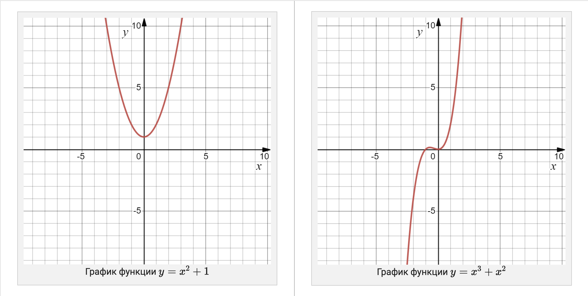

# 15. Функции
---

## 15.1 Позиционные и именованные аргументы

*Аннотация. Урок посвящен необязательным и именованным аргументам.*

### Позиционные аргументы

Все ранее написанные нами функции имели позиционные аргументы. Такие аргументы передаются без указания имен. Они называются позиционными, потому что именно по позиции, расположению аргумента, функция понимает, какому параметру он соответствует.

Рассмотрим следующий код:

```python
def diff(x, y):
    return x - y


res = diff(10, 3)    # используем позиционные аргументы
print(res)
```

Такой код выведет число `7`. При вызове функции `diff()` первому параметру `x` будет соответствовать первый переданный аргумент, `10`, а второму параметру `y` — второй аргумент, `3`.

В Python можно использовать не только позиционные, но и именованные аргументы.

### Именованные аргументы

Аргументы, передаваемые с именами, называются именованными. При вызове функции можно использовать имена параметров из ее определения. Исключение составляют списки аргументов неопределенной длины, где используются аргументы со звездочкой, но об этом в следующем уроке. Все функции из предыдущих уроков можно вызывать, передавая им именованные аргументы.

Рассмотрим следующий код:

```python
def diff(x, y):
    return x - y


res = diff(x=10, y=3)   # используем именованные аргументы
print(res)
```

Такой код по-прежнему выведет число `7`. При вызове функции `diff()` мы явно указываем, что параметру `x` соответствует аргумент `10`, а параметру `y` — аргумент `3`.

Использование именованных аргументов позволяет нарушать их позиционный порядок при вызове функции. Порядок упоминания именованных аргументов не имеет значения!

Мы можем вызвать функцию `diff()` так:

```python
res = diff(y=3, x=10)
```

и получить тот же результат `7`.

Возможность использования именованных аргументов — еще один повод давать параметрам значащие, а не однобуквенные имена.

#### Когда стоит применять именованные аргументы

Каких-то строгих правил на этот счёт не существует. Однако широко практикуется такой подход: если функция принимает больше трёх аргументов, нужно хотя бы часть из них указать по имени. Особенно важно именовать значения аргументов, когда они относятся к одному типу, ведь без имен очень трудно понять, что делает функция с подобным вызовом.

Рассмотрим определение функции `make_circle()` для рисования круга:

```python
def make_circle(x, y, radius, line_width, fill):
    # тело функции
```

Вызвать такую функцию можно так:

```python
make_circle(200, 300, 17, 2.5, True)
```

Тут непросто понять, какие параметры круга задают числа `200`, `300` или `17`.

Сравните:

```python
make_circle(x=200, y=300, radius=17, line_width=2.5, fill=True)
```

Такой код читать значительно проще!

> В соответствии с PEP 8 при указании значений именованных аргументов при вызове функции знак равенства не окружается пробелами.

Когда значение аргументов очевидно, можно их не именовать. Да, очевидность относительна, но обычно легко понять, что скрывается за значениями при вызове функции `point3d(7, 50, 13)` или `rgb(7, 255, 45)`. В первом случае переданные аргументы – координаты точки в трехмерном пространстве, во втором – значения компонент red, green, blue некоторого цвета. Тут можно ориентироваться только на здравый смысл, жестких правил нет.

Мы уже сталкивались с именованными аргументами, когда вызывали функцию `print()`.

Приведенный ниже код:

```python
print('aaaa', 'bbbbb', sep='*', end='##')
print('cccc', 'dddd', sep='()')
print('eeee', 'ffff', sep='123', end='python')
```

использует именованные аргументы `sep` и `end` и выводит:

```text
aaaa*bbbbb##cccc()dddd
eeee123ffffpython
```

Используя именованные аргументы `sep` и `end` можно не беспокоиться, какой из них указать первым.

> Напомним, что значение по умолчанию для `sep=' '` (символ пробела), а для `end='\n'` (символ перевода строки).

### Комбинирование позиционных и именованных аргументов

Мы можем вызывать функции, используя именованные и позиционные аргументы одновременно. Но позиционные значения должны быть указаны до любых именованных!

Для функции `diff()` код:

```python
res = diff(10, y=3)   # используем позиционный и именованный аргумент
```

работает как полагается, при этом параметру `x` соответствует значение `10`.

Приведенный ниже код:

```python
res = diff(x=10, 3)   # используем позиционный и именованный аргумент
```

приводит к возникновению ошибки `SyntaxError: positional argument follows keyword argument`.

### Необязательные параметры

Бывает, что какой-то параметр функции часто принимает одно и то же значение. Например, для функции `print()` создатели языка Python установили значения параметров `sep` и `end` равными символу пробела и символу перевода строки, поскольку эти значения используют наиболее часто.

Другим примером служит функция `int()`, преобразующая строку в число. Она принимает два аргумента:

*   первый аргумент: строка, которую нужно преобразовать в число;
*   второй аргумент: основание системы счисления.

Это позволяет ей считывать числа в различных системах счисления.

Приведенный ниже код преобразует двоичное число `101`:

```python
num = int('101', 2)     # аргумент 2 указывает на то, что число 101 записано в двоичной системе
```

В переменной `num` будет храниться число `5`, так как **101_2 = 5_{10}**.

Но чаще всего эта функция используется для считывания из строки чисел, записанных в десятичной системе счисления. Утомительно каждый раз писать `10` вторым аргументом. В таких ситуациях Python позволяет задавать некоторым параметрам значения по умолчанию. У функции `int()` второй параметр по умолчанию равен `10`, и потому можно вызывать эту функцию с одним аргументом. Значение второго подставится автоматически.

Чтобы задать значение параметра по умолчанию, в списке параметров функции достаточно после имени переменной написать знак равенства и нужное значение.

Параметры со значением по умолчанию идут последними, ведь иначе интерпретатор не смог бы понять, какой из аргументов указан, а какой пропущен, и для него нужно использовать значение по умолчанию.

Рассмотрим все то же определение функции `make_circle()`, которая рисует круг:

```python
def make_circle(x, y, radius, line_width, fill):
    # тело функции
```

Поскольку обычно нам нужно рисовать круг с шириной линии, равной `1` с заливкой, то логично установить данные значения в качестве значений по умолчанию:

```python
def make_circle(x, y, radius, line_width=1, fill=True):
    # тело функции
```

Теперь для того, чтобы нарисовать стандартный круг, то есть круг имеющий ширину линии, равную `1` с заливкой, мы вызываем функцию так:

```python
make_circle(100, 50, 20)
```

или так:

```python
make_circle(x=100, y=50, radius=20)
```

Если вам хочется поменять ширину линии и заливку, то вы легко можете это сделать:

```python
make_circle(x=100, y=50, radius=20, fill=False)                   # line_width=1, fill=False
make_circle(x=100, y=50, radius=20, line_width=3)                 # fill=True, line_width=3
make_circle(x=100, y=50, radius=20, line_width=5, fill=False)     # line_width=5, fill=False
```

> В соответствии со стандартом PEP 8 и при объявлении аргументов по умолчанию пробел вокруг знака равенства не ставят.

### Изменяемые типы в качестве значений по умолчанию

При использовании изменяемых типов данных в качестве значения параметра по умолчанию можно столкнуться с неожиданными результатами работы функции.

Рассмотрим определение функции `append()`, где в качестве значения по умолчанию используется изменяемый тип данных (список, тип `list`):

```python
def append(element, seq=[]):
    seq.append(element)
    return seq
```

Вызывая функцию `append()` следующим образом:

```python
print(append(10, [1, 2, 3]))
print(append(5, [1]))
print(append(1, []))
print(append(3, [4, 5]))
```

получим ожидаемый вывод:

```text
[1, 2, 3, 10]
[1, 5]
[1]
[4, 5, 3]
```

А если вызовем функцию `append()` так:

```python
print(append(10))
print(append(5))
print(append(1))
```

получим не совсем ожидаемый вывод:

```text
[10]
[10, 5]
[10, 5, 1]
```

Что происходит? Значение по умолчанию для параметра создается единожды при определении функции (обычно при загрузке модуля) и становится атрибутом (свойством) функции. Поэтому, если значение по умолчанию изменяемый объект, то его изменение повлияет на каждый следующий вызов функции.

Чтобы посмотреть значения по умолчанию, можно использовать атрибут `__defaults__`.

Приведенный ниже код:

```python
def append(element, seq=[]):
    seq.append(element)
    return seq

print('Значение по умолчанию', append.__defaults__)
```

выводит:

```text
Значение по умолчанию ([],)
```

Приведенный ниже код:

```python
def append(element, seq=[]):
    seq.append(element)
    return seq

print('Значение по умолчанию', append.__defaults__)
print(append(10))
print('Значение по умолчанию', append.__defaults__)
print(append(5))
print('Значение по умолчанию', append.__defaults__)
print(append(1))
print('Значение по умолчанию', append.__defaults__)
```

выводит:

```text
Значение по умолчанию ([],)
[10]
Значение по умолчанию ([10],)
[10, 5]
Значение по умолчанию ([10, 5],)
[10, 5, 1]
Значение по умолчанию ([10, 5, 1],)
```

Для решения проблемы можно использовать константу `None` в качестве значения параметра по умолчанию, а в теле функции устанавливать нужное значение:

```python
def append(element, seq=None):
    if seq is None:
        seq = []
    seq.append(element)
    return seq
```

Вызывая функцию `append()` следующим образом:

```python
print(append(10))
print(append(5))
print(append(1))
```

получим ожидаемый вывод:

```text
[10]
[5]
[1]
```

> Подход, основанный на значении `None`, общепринятый в Python.

### Примечания

**Примечание 1.** При написании функций стоит указывать более важные параметры первыми.

**Примечание 2.** Именованные аргументы часто используют вместе со значениями по умолчанию.

**Примечание 3.** Именованные и позиционные аргументы не всегда хорошо ладят друг с другом. При вызове функции позиционные аргументы должны обязательно идти перед именованными аргументами.

**Примечание 4.** Параметр в программировании — принятый функцией аргумент. Термин «аргумент» подразумевает, что конкретно и какой конкретной функции было передано, а параметр — в каком качестве функция применила это принятое. То есть вызывающий код передает аргумент в параметр, который определен в описании (заголовке) функции.

*   Parameter → Placeholder (заполнитель принадлежит имени функции и используется в теле функции);
*   Argument → Actual value (фактическое значение, которое передается при вызове функции).

**Примечание 5.** Отличная статья на хабре про аргументы функций в Python.


### Задача: Функция matrix()

Напишите функцию matrix(), которая создает, заполняет и возвращает матрицу заданного размера.
При этом (в зависимости от переданных аргументов) функция должна вести себя так:

* matrix() — возвращает матрицу 1х1, в которой единственное число равно нулю;
* matrix(n) — возвращает матрицу nхn, заполненную нулями;
* matrix(n, m) — возвращает матрицу из n строк и m столбцов, заполненную нулями;
* matrix(n, m, value) — возвращает матрицу из n строк и m столбцов, в которой каждый элемент равен числу value.

**Примечания:**
1. При создании функции используйте параметры по умолчанию.
2. Вызывать функцию matrix() не нужно, требуется только реализовать ее.

Решение 1
```py
# n - строки
# m - столбцы
# value - значение

def matrix(n=1, m=None, value=0):
    matrix = []
    if m == None:
        m = n
    for _ in range(n):
        temp = []
        matrix.append(temp)
        for _ in range(m):
            temp.append(value)
    return matrix


print(matrix(3, 1))
```

Решение 2
```py
def matrix(n=1, m=None, value=0):
    if m is None:
        m = n
    return [[value for _ in range(m)] for _ in range(n)]
```

### Глоссарий

✅ Позиционными называются аргументы, передаваемые без указания имён. Их значения сопоставляется с параметрами функции по позиции.
✅ Именованными называются аргументы, передаваемые с указанием имени параметра. Порядок упоминания именованных аргументов не имеет значения.
✅ Позиционные аргументы должны быть указаны до любых именованных.
✅ Необязательными называются параметры, имеющие значения по умолчанию.
✅ Значение по умолчанию для параметра создается единожды при определении функции (обычно при загрузке модуля) и становится атрибутом (свойством) функции. Поэтому, если значение по умолчанию изменяемый объект, то его изменение повлияет на каждый следующий вызов функции.

---

## 15.2 Функции с переменным количеством аргументов

### Переменное количество аргументов

Вспомним функцию `print()`, которой мы пользуемся почти в каждой задаче.

Приведенный ниже код:

```python
print('a')
print('a', 'b')
print('a', 'b', 'c')
print('a', 'b', 'c', 'd')
```

выводит:

```text
a
a b
a b c
a b c d
```

Функция `print()` принимает столько аргументов, сколько ей передано. Причем функция `print()` делает полезную работу, даже когда вызывается вообще без аргументов. В этом случае она переносит каретку печати на новую строку.

Было бы здорово научиться писать свои собственные функции, способные принимать переменное количество аргументов. Для этого потребуется специальный, совсем не сложный во всех смыслах, синтаксис.

Рассмотрим определение функции `my_func()`:

```python
def my_func(*args):
    print(type(args))
    print(args)


my_func()
my_func(1, 2, 3)
my_func('a', 'b')
```

Приведенный выше код выводит:

```text
<class 'tuple'>
()
<class 'tuple'>
(1, 2, 3)
<class 'tuple'>
('a', 'b')
```

В заголовке функции `my_func()` указан всего один параметр `args`, но со звездочкой перед ним. Звездочка в определении функции означает, что переменная (параметр) `args` получит в виде кортежа все аргументы, переданные в функцию при ее вызове от текущей позиции и до конца.

При описании функции можно использовать только один параметр помеченный звездочкой, причем располагаться он должен в конце списка параметров, иначе последующим параметрам не достанется значений.

Приведенный ниже код:

```python
def my_func(*args, num):
    print(args)
    print(num)
```

не является рабочим, так как параметр со звездочкой указан раньше позиционного `num`.

Приведенный ниже код:

```python
def my_func(num, *args):
    print(args)
    print(num)


my_func(17, 'Python', 2, 'C#')
```

связывает с переменной `num` значение `17`, а с переменной `args` значение кортежа `('Python', 2, 'C#')` и выводит:

```text
('Python', 2, 'C#')
17
```

Помеченный звездочкой параметр `*args` нормально переживает и отсутствие аргументов, в то время как позиционные параметры всегда обязательны.

Приведенный ниже код:

```python
my_func(17)
```

связывает с переменной `num` значение `17`, а с переменной `args` значение пустого кортежа `()` и выводит:

```text
()
17
```

Обратите внимание: функция `my_func()` принимает несколько аргументов, но как минимум один аргумент должен быть передан обязательно. Этот первый аргумент станет значением переменной `num`, а остальные аргументы сохранятся в переменной `args`. Подобным образом можно делать любое количество обязательных аргументов.

Параметр `args` в определении функции пишется после позиционных параметров перед первым параметром со значением по умолчанию.

### Передача аргументов в форме списка и кортежа

Иногда хочется сначала сформировать набор аргументов, а потом передать их функции. Тут поможет оператор распаковки коллекций, который также обозначается звездочкой `*`.

Вспомним, что встроенная функция `sum()` принимает на вход коллекцию чисел (список, кортеж, и т.д).

Приведенный ниже код:

```python
sum1 = sum([1, 2, 3, 4])        # считаем сумму чисел в списке
sum2 = sum((10, 20, 30, 40))    # считаем сумму чисел в кортеже

print(sum1, sum2)
```

выводит:

```text
10 100
```

Однако функция `sum()` не может принимать переменное количество аргументов.

Приведенный ниже код:

```python
sum1 = sum(1, 2, 3, 4)        

print(sum1)
```

приводит к возникновению ошибки:

```text
TypeError: sum expected at most 2 arguments, got 4
```

Напишем свою версию функции `sum()`, функцию `my_sum()`, которая принимает переменное количество аргументов и вычисляет их сумму:

```python
def my_sum(*args):
    return sum(args)    # args - это кортеж
```

Приведенный ниже код:

```python
print(my_sum())
print(my_sum(1))
print(my_sum(1, 2))
print(my_sum(1, 2, 3))
print(my_sum(1, 2, 3, 4))
```

выводит:

```text
0
1
3
6
10
```

Мы также можем вызывать нашу функцию `my_sum()`, передавая ей списки или кортежи, предварительно распаковав их.

Приведенный ниже код:

```python
print(my_sum(*[1, 2, 3, 4, 5]))   #  распаковка списка
print(my_sum(*(1, 2, 3)))         #  распаковка кортежа
```

выводит:

```text
15
6
```

> *Мой комментарий: зачем распаковывать список, если стандартная функция `sum` умеет принимать массивы:*
```py
nums = [5, 15, 51, 20, 30, 77, 100, 15]

def my_sum(*args):
    return sum(args)    # args - это кортеж


print(my_sum(5, 15, 51, 20, 30, 77, 100, 15))
print(sum(nums))

# Выводит:
# 313
# 313
```

Более того, часть аргументов можно передавать непосредственно и даже коллекции подставлять не только по одной.

Приведенный ниже код:

```python
print(my_sum(1, 2, *[3, 4, 5], *(7, 8, 9), 10))
```

выводит:

```text
49
```

> По соглашению, параметр, получающий подобный кортеж значений, принято называть `args` (от слова arguments). Старайтесь придерживаться этого соглашения.

### Получение именованных аргументов в виде словаря

Позиционные аргументы можно получать в виде `*args`, причём произвольное их количество. Такая возможность существует и для именованных аргументов. Только именованные аргументы получаются в виде словаря, что позволяет сохранить имена аргументов в ключах.

Рассмотрим определение функции `my_func()`:

```python
def my_func(**kwargs):
    print(type(kwargs))
    print(kwargs)
```

Приведенный ниже код:

```python
my_func()
my_func(a=1, b=2)
my_func(name='Timur', job='Teacher')
```

выводит:

```text
<class 'dict'>
{}
<class 'dict'>
{'a': 1, 'b': 2}
<class 'dict'>
{'name': 'Timur', 'job': 'Teacher'}
```

> По соглашению параметр, получающий подобный словарь, принято называть `kwargs` (от словосочетания keyword arguments). Старайтесь придерживаться этого соглашения.

Параметр `**kwargs` пишется в самом конце, после последнего аргумента со значением по умолчанию. При этом функция может содержать и `*args` и `**kwargs` параметры.

Рассмотрим определение функции, которая принимает все виды аргументов.

```python
def my_func(a, b, *args, name='Gvido', age=17, **kwargs):
    print(a, b)
    print(args)
    print(name, age)
    print(kwargs)
```

Приведенный ниже код:

```python
my_func(1, 2, 3, 4, name='Timur', age=28, job='Teacher', language='Python')
my_func(1, 2, name='Timur', age=28, job='Teacher', language='Python')
my_func(1, 2, 3, 4, job='Teacher', language='Python')
```

выводит (пустая строка вставлена для наглядности):

```text
1 2
(3, 4)
Timur 28
{'job': 'Teacher', 'language': 'Python'}

1 2
()
Timur 28
{'job': 'Teacher', 'language': 'Python'}

1 2
(3, 4)
Gvido 17
{'job': 'Teacher', 'language': 'Python'}
```

Не нужно пугаться, в реальном коде функции редко используют все эти возможности одновременно. Но понимать, как каждая отдельная форма объявления аргументов работает, и как такие формы сочетать — очень важно.

Для лучшего понимания, поэкспериментируйте с передачей аргументов. Правила использования аргументов довольно сложно описывать, но на практике мы редко сталкиваемся с проблемами.

### Передача именованных аргументов в форме словаря

Как и в случае позиционных аргументов, именованные можно передавать в функцию "пачкой" в виде словаря. Для этого нужно перед словарём поставить две звёздочки.

Рассмотрим определение функции `my_func()`:

```python
def my_func(**kwargs):
    print(type(kwargs))
    print(kwargs)
```

Приведенный ниже код:

```python
info = {'name':'Timur', 'age':'28', 'job':'teacher'}

my_func(**info)
```

выводит:

```text
<class 'dict'>
{'name': 'Timur', 'age': '28', 'job': 'teacher'}
```

Рассмотрим еще один пример определения функции `print_info()`, распечатывающей информацию о пользователе.

```python
def print_info(name, surname, age, city, *children, **additional_info):
    print('Имя:', name)
    print('Фамилия:', surname)
    print('Возраст:', age)
    print('Город проживания:', city)
    if len(children) > 0:
        print('Дети:', ', '.join(children))
    if len(additional_info) > 0:
        print(additional_info)
```

Приведенный ниже код:

```python
children = ['Бодхи Рансом Грин', 'Ноа Шэннон Грин', 'Джорни Ривер Грин']
additional_info = {'height':163, 'job':'actress'}

print_info('Меган', 'Фокс', 34, 'Ок-Ридж', *children, **additional_info)
```

выводит:

```text
Имя: Меган
Фамилия: Фокс
Возраст: 34
Город проживания: Ок-Ридж
Дети: Бодхи Рансом Грин, Ноа Шэннон Грин, Джорни Ривер Грин
{'height': 163, 'job': 'actress'}
```

При подстановке аргументов "разворачивающиеся" наборы аргументов вроде `*positional` и `**named` можно указывать вперемешку с аргументами соответствующего типа: `*positional` с позиционными, а `**named` — с именованными.

**Все именованные аргументы должны идти после всех позиционных.**

### Keyword-only аргументы

В Python 3 добавили возможность пометить именованные аргументы функции так, чтобы вызвать функцию можно было, только передав эти аргументы по именам. Такие аргументы называются keyword-only и их нельзя передать в функцию в виде позиционных.

Рассмотрим определение функции `make_circle()`:

```python
def make_circle(x, y, radius, *, line_width=1, fill=True):
```

Здесь `*` выступает разделителем: отделяет обычные аргументы (их можно указывать по имени и позиционно) от строго именованных.

Приведенный ниже код работает как и полагается:

```python
make_circle(10, 20, 5)                                     # x=10, y=20, radius=5,  line_width=1, fill=True
make_circle(x=10, y=20, radius=7)                          # x=10, y=20, radius=7,  line_width=1, fill=True
make_circle(10, 20, radius=10, line_width=2, fill=False)   # x=10, y=20, radius=10, line_width=2, fill=False
make_circle(x=10, y=20, radius=17, line_width=3)           # x=10, y=20, radius=17, line_width=3, fill=True
```

То есть аргументы `x`, `y` и `radius` могут быть переданы в качестве как позиционных, так и именованных аргументов. При этом аргументы `line_width` и `fill` могут быть переданы только как именованные аргументы.

Приведенный ниже код:

```python
make_circle(10, 20, 15, 20)
make_circle(x=10, y=20, 15, True)
make_circle(10, 20, 10, 2, False)
```

приводит к возникновению ошибок.

Этот пример неплохо демонстрирует подход к описанию аргументов. Первые три аргумента — координаты центра круга и радиус. Координаты центра и радиус присутствуют у круга всегда, поэтому обязательны и их можно не именовать. А вот `line_width` и `fill` — необязательные аргументы, ещё и получающие ничего не говорящие значения. Вполне логично ожидать, что вызов вида `make_circle(10, 20, 5, 3, False)` мало кому понравится! Ради ясности аргументы `line_width` и `fill` и объявлены так, что могут быть указаны только явно через имя.

Мы также можем объявить функцию, у которой будут только строго именованные аргументы, для этого нужно поставить звёздочку в самом начале перечня аргументов.

```python
def make_circle(*, x, y, radius, line_width=1, fill=True):
```

Теперь для вызова функции `make_circle()` нам нужно передать значения всех аргументов явно через их имя:

```python
make_circle(x=10, y=20, radius=15)                              # line_width=1, fill=True
make_circle(x=10, y=20, radius=15, line_width=4, fill=False)
```

Такой разделитель можно использовать только один раз в определении функции.
**Его нельзя применять в функциях с неограниченным количеством позиционных аргументов `*args`.**

### Примечания

**Примечание 1.** Специальный синтаксис `*args` и `**kwargs` в определении функции позволяет передавать функции переменное количество позиционных и именованных аргументов. При этом `args` и `kwargs` просто имена. Вы не обязаны их использовать, можно выбрать любые, однако среди Python программистов приняты именно эти.

**Примечание 2.** Вы можете использовать одновременно `*args` и `**kwargs` в одной строке для вызова функции. В этом случае порядок имеет значение. Как и аргументы, не являющиеся аргументами по умолчанию, `*args` должны предшествовать и аргументам по умолчанию, и `**kwargs`. Правильный порядок параметров:

1.  позиционные аргументы,
2.  `*args` аргументы,
3.  `**kwargs` аргументы.

```python
def my_func(a, b, *args, **kwargs):
```

**Правильная последовательность:**
1. Позиционные аргументы без значений по умолчанию
2. Позиционные аргументы со значениями по умолчанию
3. Позиционные аргументы, указанные как *args
4. Именованные аргументы
5. Именованные аргументы, указанные как *kwargs

- **По умолчанию мы задаём в параметре**
- **Именованные задаём в аргументе при вызове**

---

### Дополнительно

#### Вариант 1. Классический порядок (аргументы по умолчанию ДО *args)
Если вы ставите аргумент по умолчанию до `*args`, его можно передавать как обычный позиционный аргумент.

```python
def func(a, b=2, *args, **kwargs):
    print(a, b, args, kwargs)

func(1, 20, 3, 4, x=5) # b примет значение 20, а в args уйдут (3, 4)
```

* Порядок: Позиционные → По умолчанию → *args → **kwargs.

#### Вариант 2. Аргументы только по ключевому слову (ПОСЛЕ *args)
Если аргумент по умолчанию стоит после `*args`, он превращается в так называемый keyword-only аргумент.
Это значит, что Python физически не позволит передать его по позиции — его можно вызвать строго по имени.

```py
def func(a, *args, b=2, **kwargs):
    print(a, args, b, kwargs)

func(1, 3, 4, b=20, x=5)# Все позиционные числа после 1 уходят в args: (3, 4)# Чтобы изменить b, нужно явно написать b=20
```

* Порядок: Позиционные → *args → По умолчанию (keyword-only) → **kwargs.

#### Итог
Главное железное правило, которое актуально всегда:

   1. *args всегда идет раньше **kwargs.
   2. **kwargs всегда пишется самым последним в строке.

---

### Полный пример с передачей всех типов аргументов в параметры функции

```py
def super_func(
    a,          # 1. Позиционный без значения по умолчанию
    b=10,       # 2. Позиционный со значением по умолчанию (до звезды)
    *args,      # 3. Собиратель лишних позиционных аргументов
    c=99,       # 4. Именованный аргумент (keyword-only, так как после звезды)
    **kwargs    # 5. Собиратель лишних именованных аргументов
):
    print(f"a (позиц. обязат.) = {a}")
    print(f"b (позиц. дефолт)   = {b}")
    print(f"args (хвост позиц.) = {args}")
    print(f"c (именованный)    = {c}")
    print(f"kwargs (хвост имен) = {kwargs}")
    print("-" * 30)

# --- ТЕСТИРУЕМ РАЗНЫЕ ВАРИАНТЫ ВЫЗОВА ---

# Вызов А: Передаем только минимум (только для 'a')
# 'b' и 'c' берут дефолт, args и kwargs пустые
super_func(5)
# Напечатает: a=5, b=10, args=(), c=99, kwargs={}

# Вызов Б: Передаем два числа подряд
# 5 уйдет в 'a', а 15 перезапишет позиционный 'b'! args все еще пустой.
super_func(5, 15)
# Напечатает: a=5, b=15, args=(), c=99, kwargs={}

# Вызов В: Передаем много чисел подряд
# 5 -> a, 15 -> b, а все остальные числа (20, 30) залетают в кортеж args
super_func(5, 15, 20, 30)
# Напечатает: a=5, b=15, args=(20, 30), c=99, kwargs={}

# Вызов Г: Полный фарш (передаем абсолютно всё)
# Позиционные числа распределяются по порядку (в a, b и args).
# Чтобы изменить 'c', мы ОБЯЗАНЫ написать его имя 'c=77'.
# Все остальные неизвестные имена (x, y) улетают в словарь kwargs.
super_func(5, 15, 20, 30, c=77, x="Я в kwargs", y=100)
# Напечатает: a=5, b=15, args=(20, 30), c=77, kwargs={'x': 'Я в kwargs', 'y': 100}
```

---

### Задачи

2. 
```py
def sq_sum(*args: object) -> int | float:
    """
    Принимает произвольное количество числовых аргументов
    Возвращает сумму их квадратов
    """
    # Генератор вместо создания списка для экономии памяти
    return sum(n**2 for n in args)


# Тестовые данные
print(sq_sum(1, 2, 3))
# Выводит: 14
```

3.
```py
def mean(*args) -> float:
    """
    Принимает массив произвольных элементов
    Возвращает avg для элементов int и float
    """
    nums = [n for n in args if type(n) in (int, float)]
    if not nums:
        return 0.0
    return sum(nums) / len(nums)


# Тестовые данные
print(mean(1.5, True, ['stepik'], 'beegeek', 2.5, (1, 2)))
# Выводит: 2.0
```

4.
```py
def greet(name: str, *args: str) -> str:
    """
    Принимает произвольное количество строк-имен.
    Возвращает приветствие в соответствии с тестовыми данными.
    """
    return f"Hello, {' and '.join([name, *args])}!"


# Тестовые данные
print(greet('Timur', 'Roman', 'Ruslan'))
# Выводит: Hello, Timur and Roman and Ruslan!
```

5.
```py
def print_products(*args: object) -> None:
    """
    Принимает произвольное количество аргументов
    Выводит:
        - <номер продукта>) <название продукта>
        - "Нет продуктов"
    * Нумерация продуктов начинается с единицы
    """
    products = [p for p in args if (type(p) is str and p)]

    if not products:
        print('Нет продуктов')
        return
    # Используем генератор для экономии памяти
    print(*(f'{i}) {p}' for i, p in enumerate(products, 1)), sep='\n')

print_products('Бананы', [1, 2], ('Stepik',), 'Яблоки', '', 'Макароны', 5, True)
```

6.
```py
def info_kwargs(**kwargs: object) -> None:
    """
    Принимает произвольное количество именнованных аргументов
    Печатает именованные аргументы в следующем формате:
        <имя аргумента>: <значение аргумента>
    *В алфавитном порядке по именам
    """
    # Используем генератор для экономии памяти
    print(*(f'{key}: {value}' for key, value in sorted(kwargs.items())), sep='\n')


info_kwargs(first_name='Timur', last_name='Guev', age=28, job='teacher')

# age: 28
# first_name: Timur
# job: teacher
# last_name: Guev
```

```py
# Если выкинуть items и отсортировать словарь по умолчанию,
# снижается производительность из-за обращения по i на каждой итерации
print(*(f'{i}: {kwargs[i]}' for i in sorted(kwargs)), sep='\n')
```

Самый чистый вариант:
```py
def info_kwargs(**kwargs: object) -> None:
    """
    Принимает произвольное количество именнованных аргументов
    Печатает именованные аргументы в следующем формате:
        <имя аргумента>: <значение аргумента>
    *В алфавитном порядке по именам
    """
    for key, val in sorted(kwargs.items()):
        print(f'{key}: {val}')
```

---

### Глоссарий

✅ Позиционные аргументы можно получать в виде `*args`. Аргументы собираются в кортеж от текущей позиции до конца. Позволяет передавать функции переменное количество позиционных аргументов.

✅ Именованные аргументы можно получать в виде `**kwargs`. Аргументы собираются в словарь, где ключ — имя, а значение — переданный аргумент. Позволяет передавать функции переменное количество именованных аргументов.

✅ Keyword-only аргументы — это аргументы, которые можно передавать только по имени. Чтобы задать их, в определении функции используют символ `*` как разделитель: он отделяет обычные аргументы (их можно указывать по имени и позиционно) от строго именованных.

---

## 15.3 Парадигмы программирования

**Парадигма программирования** — совокупность идей и понятий, определяющих стиль написания компьютерных программ.

**Парадигма программирования определяется:**
  *   вычислительной моделью;
  *   базовой программной единицей (-ами);
  *   методами разделения абстракций.

**Императивное программирование** — это парадигма программирования, которая описывает процесс вычисления в виде инструкций, изменяющих состояние данных. Подразделы императивного программирования — структурное и объектно-ориентированное.

**Декларативное программирование** — это парадигма программирования, в которой вместо пошагового алгоритма решения задачи задаётся спецификация решения задачи, то есть описывается, что собой представляет проблема и что требуется получить в качестве результата. Декларативные программы не используют понятия состояния и, в частности, не содержат переменных и операторов присваивания. К декларативной парадигме относится функциональное программирование.

```
              ┌───────────────────────────────────────────┐
              │        Парадигмы программирования         │
              └────┬─────────────────┬────────────────┬───┘
                   │                 │                │
                   ▼                 ▼                ▼
  ┌────────────────────┐   ┌───────────────────┐   ┌──────────────────┐
  │    Императивное    │   │   Декларативное   │   │   Визуальное     │
  │  программирование  │   │  программирование │   │ программирование │
  └────┬───────────┬───┘   └───────────────┬───┘   └──────────────────┘
       │           │                       │
       ▼           ▼                       ▼
┌─────────────┐┌─────────────────┐    ┌──────────────────────┐
│ Структурное ││    Объектно-    │    │   Функциональное     │
│             ││ ориентированное │    │                      │
└─────────────┘└─────────────────┘    └──────────────────────┘
```

### Пять мастеров стройки

**Метафора:** Программирование — это «искусство строить цифровые миры из кода».  
**Парадигма** (с греч. «образец, модель») — это наш стиль мышления, стратегия того, как именно мы будем строить наш «дом».

Представьте, что вы строите дом и нанимаете разных мастеров:

-   **Императивный:** Послушный исполнитель с пошаговым списком команд.
-   **Структурный:** Организатор, делящий работу на профильные бригады (функции).
-   **ООП:** Конструктор, собирающий дом из готовых «умных» модулей-контейнеров.
-   **Функциональный:** Оператор 3D-принтера (рецепт + сырье = идеальная копия).
-   **Логический:** Инженер-контролер с ИИ, проверяющий чертежи на ошибки.

---

### Объяснение парадигм простыми словами

1. **Императивное программирование**
Это как инструкции для выполнения задач. Вы говорите компьютеру, что делать и как делать. Это похоже на рецепт приготовления блюда: шаг за шагом, вы указываете, что делать, и машина выполняет команды в том порядке, в котором они записаны.

2. **Структурное программирование**
Это способ организации кода, где задача разбивается на более мелкие части, называемые функциями. Каждая функция выполняет определенную задачу, и это делает код более читаемым и управляемым.

3. **Объектно-ориентированное программирование (ООП)**
В этой парадигме программирования мы думаем о программе как о мире, где есть объекты, обладающие характеристиками и способностями. Например, автомобиль может иметь цвет (характеристика) и может двигаться (способность). Мы создаем классы, которые описывают эти объекты, и работаем с ними.

4. **Функциональное программирование**
Здесь программирование больше похоже на математику. Мы используем функции, которые принимают данные и возвращают результаты. Мы избегаем изменения данных и вместо этого создаем новые данные на основе старых. Это делает код более предсказуемым и удобным для тестирования.

5. **Логическое программирование**
В этой парадигме мы описываем, что мы хотим получить, а не как это сделать. Мы задаем логические правила и отношения, и компьютер сам находит способ достичь нужного результата. Это как дать машине загадку, и она сама находит ответ.

*Каждая из этих парадигм имеет свои сильные стороны и используется в разных ситуациях. Это как разные инструменты в наборе для создания чего-то нового. Когда вы знаете, какой инструмент выбрать, вы можете создать прекрасные программы и приложения!*

---

## 15.4 Функции как объекты

*Аннотация. Урок посвящен основным концепциям функционального программирования.*

### Функции как объекты

До сих пор мы рассматривали функции как отдельный элемент языка со своим синтаксисом и механизмом работы. Но, оказывается, функции также что-то вроде особого типа объектов. Бывают числа, строки, списки, кортежи, словари, множества. А бывают — функции. У каждого из этих типов есть свои операции, свой синтаксис, но все они — объекты.

Напомним, что язык Python мультипарадигменный, он одинаково хорошо поддерживает и функциональную и объектно-ориентированную парадигмы программирования.

Приведенный ниже код:

```python
num = 17
numbers = [1, 2, 3]
colors = (1, 2, 3)
name = 'Python'

print(type(num))
print(type(numbers))
print(type(colors))
print(type(name))
```

выводит:

```text
<class 'int'>
<class 'list'>
<class 'tuple'>
<class 'str'>
```

Таким образом, целое число — объект типа `int`, список — объект типа `list`, кортеж — объект типа `tuple`, строка — объект типа `str` и т.д.

Любая функция в языке Python — объект типа `function`.

Приведенный ниже код:

```python
print(type(print))
print(type(sum))
print(type(abs))
```

выводит:

```text
<class 'builtin_function_or_method'>
<class 'builtin_function_or_method'>
<class 'builtin_function_or_method'>
```

Python выдает нам строку `<class 'builtin_function_or_method'>`, которая поясняет, что `print`, `sum`, `abs` — встроенные функции языка, или методы.

> **Обрати внимание:** скобки не ставим при передаче аргумента в функцию `type()`, мы не вызываем функцию, а передаем ее название.

Мы также можем объявить свою функцию, которая тоже является объектом.

Приведенный ниже код:

```python
def hello():
    print('Hello from function')


print(type(hello))
```

выводит:

```text
<class 'function'>
```

В языке Python все объект: число, строка, список, кортеж, множество, словарь, даже функция.

Поскольку функции тоже объекты, работать с ними можно и как с объектами: записывать их в переменные, передавать в качестве аргументов другим функциям, возвращать из функций и т.д.

Приведенный ниже код:

```python
def hello():
    print('Hello from function')


func = hello     #  присваиваем переменной func функцию hello
func()           #  вызываем функцию
```

выводит:

```text
Hello from function
```

Таким образом, теперь переменную `func` можно использовать для вызова функции `hello()`.

Рассмотрим еще один пример. Если по какой-либо причине вам не нравится название встроенной функции `print()`, которая выводит указанный текст на экран, можно написать такой код:

```python
writeln = print            # как в языке Pascal 😀

writeln('Hello world!')
writeln('Python')
```

Такой код выводит:

```text
Hello world!
Python
```

Возможность записать функцию в переменную позволяет гибко управлять тем, какую функциональность мы хотим использовать. В одну и ту же переменную можно записать разные варианты поведения и менять их при необходимости. При этом не только не нужно будет менять код по всей программе, но и не придется даже изменять код функций. Достаточно переменной присвоить вместо одной функции — другую.

Представим себе ситуацию, когда необходимо выполнить некую функцию, если задано имя команды. Для простоты предположим, если пришла команда `start` — надо выполнить функцию `start()`, если команда `stop` — функцию `stop()`, если команда `pause` — функцию `pause()`.

Такую логику легко можно написать при помощи условного оператора `if .. elif`.

```python
def start():
    # тело функции start
    pass


def stop():
    # тело функции stop
    pass


def pause():
    # тело функции pause
    pass


command = input()  # считываем название команды

if command == 'start':
    start()
elif command == 'stop':
    stop()
elif command == 'pause':
    pause()
```

Однако если команд будет много или если их количество будет увеличиваться, то оператор `if` получится слишком громоздким. В этом случае можно создать словарь, где ключом служит название команды, а значением — соответствующая функция.

Приведенный ниже код решает ту же самую задачу, но более гибко:

```python
def start():
    # тело функции start
    pass


def stop():
    # тело функции stop
    pass


def pause():
    # тело функции pause
    pass


commands = {'start': start, 'stop': stop, 'pause': pause}  # словарь соответствия команда → функция

command = input()  # считываем название команды

commands[command]()  # вызываем нужную функцию через словарь по ключу
```

Таким образом, вся логика обработчика команды сводится к очень простой строке:

```python
commands[command]()
```

где переменная `command` — имя команды, которую надо выполнить. Такой код намного гибче!

### Функции в качестве аргументов других функций

Возможность присваивать имя функции переменной позволяет, в частности, передавать имя функции аргументом другой функции. Это доступно во многих языках, но в Python проще, благодаря его гибкой типизации.

Это позволяет легко и красиво решать сложные задачи. Классическая иллюстрация – математические задачи, где функциональная зависимость играет роль внешнего фактора.

Например, есть программная функция построения графика для заданной математической функции. Если нужно строить графики многих математических функций, то каждый раз придется писать новую функцию, или модифицировать имеющуюся.

Но логика построения графика функции практически не зависит от типа математической функции, поэтому можно рассматривать математическую функцию как аргумент программной функции построения графика. Определим функцию `plot()`, которая принимает 3 аргумента: `f` – функцию, для которой хотим построить график, и `a`, `b` – границы диапазона построения графика.

```python
def plot(f, a, b):
    print(f"Строим график в диапазоне [{a}; {b}]")
    # Внутри plot() мы передаем значение x в функцию f
    for x in range(a, b + 1):
        y = f(x)
        print(f"x={x}, y=f(x)={y}")
```

При запуске функции `plot()` мы можем указать, для какой именно функции строим график. Например, пусть у нас есть следующие математические функции:

```python
def square_add_one(x):
    return x*x + 1
 
def cube_add_square(x):
    return x**3 + x**2
```

Чтобы нарисовать график функции **y = x^2 + 1** в диапазоне [1; 10], достаточно выполнить функцию `plot()` со следующими аргументами:

```python
plot(square_add_one, 1, 10)
```

**Полный код**

```python
# [Шаг 1] Объявление функции plot (принимает f как объект, a и b как числа)
def plot(f, a, b):
    print(f"Строим график в диапазоне [{a}; {b}]")
    for x in range(a, b + 1):
        # [Шаг 5] Вызов переданной функции f(x) (Шаг 2)
        y = f(x) # [Шаг 7] Присваивание y результата из Шаг 6
        print(f"x={x}, y=f(x)={y}")

# [Шаг 2] Объявление функции square_add_one (ожидает аргумент x)
def square_add_one(x):
    # [Шаг 6] Вычисление и возврат значения обратно в Шаг 5
    return x*x + 1
 
# [Шаг 3] Объявление функции cube_add_square (ожидает аргумент x)
def cube_add_square(x):
    return x**3 + x**2

# [Шаг 4] Запуск: передача функции square_add_one и чисел 1, 10 в plot
# Переменные внутри plot становятся равны: f = square_add_one, a = 1, b = 10
plot(square_add_one, 1, 10)
```

Аналогично, вызов функции `plot(cube_add_square, -10, 10)` построит график функции **y = x^3 + x^2** в диапазоне [-10; 10].



Логику работы функции `plot()` не нужно менять, достаточно передать ей функциональный объект, используемый внутри. Такой подход работает во многих популярных библиотеках Python. В библиотечные функции мы передаем ту логику, которая нужна нам, вместо стандартной, реализованной в библиотеке.

### Функция высшего порядка

Это архитектурный термин (категория).
Функция считается функцией высшего порядка, если выполняется хотя бы одно из двух условий:

   1. Она принимает другую функцию как аргумент (например: plot, max, sorted).
   2. Она возвращает другую функцию как результат своей работы.

Встроенные функции `min()`, `max()`, `sorted()` – функции высшего порядка, так как принимают в качестве аргумента функцию сравнения элементов.
   
### Встроенные функции, принимающие функции в качестве аргументов

В прошлых уроках мы изучили встроенные функции:

*   `min()`: поиск минимального элемента;
*   `max()`: поиск максимального элемента;
*   `sorted()`: сортировка данных.

> Не путайте списочный метод `sort()` и встроенную функцию `sorted()`. Они работают одинаково, но списочный метод `sort()` сортирует список на месте, а функция `sorted()` возвращает новый, отсортированный список.

Продемонстрируем работу функций на примере:

```python
numbers = [10, -7, 8, -100, -50, 32, 87, 117, -210]

print(max(numbers))
print(min(numbers))
print(sorted(numbers))
```

Приведенный выше код выводит:

```text
117
-210
[-210, -100, -50, -7, 8, 10, 32, 87, 117]
```

### Аргумент key

Но что, если мы хотим написать код для поиска максимального по модулю элемента списка `numbers`?
И вообще, сравнивать элементы не стандартным способом, а более специфическими?

На этот случай все выше перечисленные встроенные функции могут принимать необязательный аргумент `key` – функцию, определяющую условия сравнения элементов.  

Другими словами, **значение `key` должно быть функцией, принимающей один аргумент (элемент массива) и возвращающей на его основе ключ для сравнения ()**.

*«Функция, записанная в `key`, применяется к каждому элементу массива. На основе полученных вычислений выполняется функция высшего порядка (`min` / `max` / `sorted` и т.д., где `key` передан аргументом). При этом в результат выводятся исходные значения массива».*

⚠️ В самом Python этот аргумент встроен в строго определенный набор функций и методов, которые занимаются поиском или сортировкой:

- `min()` — поиск минимума.
- `max()` — поиск максимума.
- `sorted()` — сортировка (возвращает новый список).
- `.sort()` — метод списков (сортирует список на месте).
- `heapq.nlargest()` и `heapq.nsmallest()` — **функции из встроенного модуля heapq для поиска нескольких наибольших/наименьших элементов**.

> В свои собственные функции вы можете добавить аргумент с именем `key` вручную, если напишете такую логику (как мы делали с f в функции plot).

💡 **Компаратор:** функция (после `key='), определяющая условия сравнения элементов (compare – сравнивать).

Продемонстрируем вышесказанное на примере кода:

```python
numbers = [10, -7, 8, -100, -50, 32, 87, 117, -210]

print(max(numbers, key=abs))        #  указываем функцию abs в качестве компаратора
print(min(numbers, key=abs))        #  указываем функцию abs в качестве компаратора
print(sorted(numbers, key=abs))     #  указываем функцию abs в качестве компаратора
```

Приведенный выше код выводит:

```text
-210                                         # максимальный по модулю элемент
-7                                           # минимальный по модулю элемент
[-7, 8, 10, 32, -50, 87, -100, 117, -210]    # сортировка на основании модулей элементов
```

Рассмотрим еще один пример.

Пусть в списке `points` хранятся в виде кортежей координаты точек плоскости в двумерной биполярной системе координат.

```python
points = [(1, -1), (2, 3), (-10, 15), (10, 9), (7, 18), (1, 5), (2, -4)]
```

При использовании встроенной функции `sorted()` (или списочного метода `sort()`) сортировка пройдет по первым значениям пар кортежа, а в случае их совпадения – по вторым.

Таким образом, приведенный ниже код:

```python
points = [(1, -1), (2, 3), (-10, 15), (10, 9), (7, 18), (1, 5), (2, -4)]

points.sort()    #  сортируем список точек на месте

print(points)
```

выводит:

```text
[(-10, 15), (1, -1), (1, 5), (2, -4), (2, 3), (7, 18), (10, 9)]
```

Рассмотрим следующий код:

```python
def compare_by_second(point):
    return point[1]


def compare_by_sum(point):
    return point[0] + point[1]


points = [(1, -1), (2, 3), (-10, 15), (10, 9), (7, 18), (1, 5), (2, -4)]

print(sorted(points, key=compare_by_second))   # сортируем по второму значению кортежа
print(sorted(points, key=compare_by_sum))      # сортируем по сумме кортежа
```

Он выводит:

```text
[(2, -4), (1, -1), (2, 3), (1, 5), (10, 9), (-10, 15), (7, 18)]
[(2, -4), (1, -1), (2, 3), (-10, 15), (1, 5), (10, 9), (7, 18)]
```

### Функции в качестве возвращаемых значений других функций

Объектная сущность функций позволяет и передавать их в качестве аргументов в другие функции, и возвращать одни функции из других. То есть, функции могут быть результатом работы других функций, что позволяет писать генераторы функций, возвращающие функции в зависимости от передаваемых им аргументов.

Рассмотрим код, где функция `generator()` возвращает функцию `hello()` в качестве результата своей работы.

```python
def generator():
    def hello():
        print('Hello from function!')
    return hello
```

Результат работы функции `generator()` можно записать в переменную, и использовать эту переменную как функцию.

Приведенный ниже код:

```python
func = generator()
func()
```

выводит:

```text
Hello from function!
```

**Разбор**
```python
def generator():
    def hello():
        print('Hello from function!')
    return hello  # Вернули функцию как объект (схему). Вызова нет без скобок.

# Запустили генератор функции, получили объект, назвали её func
func = generator()  # Переменная func становится ссылкой на функции hello

print("Сейчас будет вызов...")
func()  # Теперь код внутри hello() выполнился - вызов со скобками
```

#### Техническое описание процесса

   1. Создание объекта: При вызове `generator()` в оперативной памяти создается объект функции `hello`. Он имеет свой уникальный адрес (id).
   2. Возврат адреса: Инструкция `return hello` возвращает наружу не код, а адрес **(ссылку)** на этот объект в памяти.
   3. Связывание (Binding): Строка `func = generator()` записывает возвращенный адрес в переменную `func`. Никакого дублирования или копирования объекта в памяти не происходит. **Переменная `func` теперь указывает на тот же самый адрес, где физически находится функция `hello`**.
   4. **Вызов по ссылке: Оператор `func()` обращается по этому адресу и запускает выполнение инструкций внутри функции `hello`.**

💡 В Python можно определять функцию внутри функции, ведь функция это объект.

Приведенный выше пример не очень информативен, но идею можно использовать и для построения более мощных генераторов функций. Например, рассмотрим семейство функций — квадратных трехчленов. Все эти функции имеют один и тот вид **f(x) = ax^2 + bx + c**, но поведение конкретного квадратного трехчлена зависит от значения параметров **a, b, c**. Мы можем написать генератор функций, который по параметрам **a, b, c** построит и вернет нам конкретный квадратный трехчлен:

```python
def generator_square_polynom(a, b, c):
    def square_polynom(x):
        return a * x**2 + b * x + c

    return square_polynom
```

Приведенный ниже код:

```python
f = generator_square_polynom(a=1, b=2, c=1)
g = generator_square_polynom(a=2, b=0, c=-3)
h = generator_square_polynom(a=-3, b=-10, c=50)

print(f(1))
print(g(2))
print(h(-1))
print(f)  # Вызываем функцию без скобок
```

выводит:

```text
4
5
57
<function generator_square_polynom.<locals>.square_polynom at 0x102eff740>
```

Другими словами мы построили функции **f(x)=x^2+2x+1**, **g(x)=2x^2-3**, **h(x)=-3x^2-10x+50**.

Обратите внимание на то, что внутренняя функция `square_polynom()` использует параметры внешней функции `generator_square_polynom()`. Такую вложенную функцию называют **замыканием**.

> **Замыкания:** вложенные функции, ссылающиеся на переменные, объявленные вне определения этой функции, и не являющиеся её параметрами.

> Последний вызов без скобок:
> В этом примере выводится строковое представление функции, которое говорит нам в какой ячейке в памяти она находится.
> Таким образом когда мы обращаемся к функции без скобок, мы прежде всего обращаемся к местоположению этой функции у себя на компьютереь (у каждого оно разное) и затем функция, так как это объект, предоставляет нам своё строковое представление, которое мы и видим в консоли.

> Если же мы обратимся к функции со скобочками, то тогда в этот момент мы вызовем эту функцию по данной ячейке в памяти и выполним тот код которая она хранит в своём теле, что соответственно и даст нам ожидаемый результат.

⚠️ Функция `generator_square_polynom` это обёртка для функции `square_polynom`, т.е. является **декоратором**.

#### Разбор

```py
# Объявление внешней функции, которая принимает коэффициенты a, b, c
def generator_square_polynom(a, b, c):
    # Объявление вложенной функции, которая принимает переменную x
    def square_polynom(x):
        # Расчет формулы с использованием x и сохраненных в памяти a, b, c
        return a * x**2 + b * x + c

    # Возврат ссылки на внутреннюю функцию square_polynom во внешний код
    return square_polynom


# Вызов внешней функции; она возвращает внутреннюю функцию, которая записывается в f
f = generator_square_polynom(a=1, b=2, c=1)
# Вызов внешней функции; создается и возвращается вторая копия внутренней функции в g
g = generator_square_polynom(a=2, b=0, c=-3)
# Вызов внешней функции; создается и возвращается третья копия внутренней функции в h
h = generator_square_polynom(a=-3, b=-10, c=50)

# Вызов функции f (которая внутри является square_polynom) с передачей x=1
print(f(1))
# Вызов функции g (которая внутри является square_polynom) с передачей x=2
print(g(2))
# Вызов функции h (которая внутри является square_polynom) с передачей x=-1
print(h(-1))
```

**Суть процесса:**

   1. Выражение generator_square_polynom(a=1, b=2, c=1) выполняется (так как стоят круглые скобки).
   2. В процессе его выполнения создается изолированная область памяти, куда записываются a=1, b=2, c=1.
   3. В этой же области создается функция square_polynom.
   4. Строка return square_polynom берет эту созданную функцию и «выплёвывает» её наружу.
   5. Переменная f ловит этот результат. Теперь в f лежит не generator_square_polynom, а то, что она вернула — то есть square_polynom.


#### Разбор Степик

```py
# Cначала мы вызываем внешнюю функцию и передаём ей соответствующие аргументы:
def generator_square_polynom(a, b, c):
    def square_polynom(x):
        return a * x**2 + b * x + c

    return square_polynom

# Эта внешняя функция возвращает другую функцию (square_polynom) - вложенную.
# Мы возвращаем тут не результат самой вложенной функции, а описание этой вложенной функции,

# которую впоследствии мы и можем вызвать:
# def square_polynom(x):
#     return a * x**2 + b * x + c
# 
# Тут нет скобок:
# return square_polynom

f = generator_square_polynom(a=1, b=2, c=1)
g = generator_square_polynom(a=2, b=0, c=-3)
h = generator_square_polynom(a=-3, b=-10, c=50)

# Потом мы вызываем вложенную функцию, для которой передаём другие, соответствующие для неё аргументы:
print(f(1))
print(g(2))
print(h(-1))
```

---

#### Вызов вложенной функции двойными скобками

Конструкция вида `func(a, b, c)(x)` позволяет вызвать вложенную функцию напрямую, без промежуточного присваивания в переменную.

**Как это работает:**
Выражение выполняется строго слева направо в два этапа:

   1. Первые скобки `generator_square_polynom(1, 2, 1)` — вызывают внешнюю функцию. Она отрабатывает и возвращает объект вложенной функции `square_polynom`.
   2. Вторые скобки (1) — применяются к результату первого шага. Они передают аргумент x напрямую во вложенную функцию и запускают её расчет.

Пример для конспекта:

```python
# Передача аргументов в обе функции в одну строку
result = generator_square_polynom(a=1, b=2, c=1)(1)  # Выведет: 4
```

**Ограничение:**
Нельзя передавать все аргументы в одних скобках: `generator_square_polynom(1, 2, 1, 1)`. Это вызовет ошибку TypeError, так как внешняя функция ожидает строго 3 параметра, а не 4.

---

### Разбор механизма памяти замыканий

Это то, что уберёт страх перед вложенными функциями. Вы начнёте чётко видеть, где именно компьютер сохраняет настройки.
Когда мы пишем вложенную функцию, которая использует переменную из внешней функции, Python автоматически создаёт замыкание (closure).

**Замыкание** — это особый объект функции, который несёт с собой «скрытый рюкзак» с переменными. Эти переменные живут в рюкзаке даже тогда, когда внешняя функция уже полностью завершила свою работу и стёрлась из памяти.
Давайте посмотрим, как устроен этот «рюкзак» под капотом, на примере кода:

```python
def pow(p):
    def numpower(n):
        return n**p  # Функция numpower использует внешнюю переменную p

    return numpower

# Создаём две разные функции
f_square = pow(2)
f_cube = pow(3)
```

#### Как заглянуть внутрь памяти компьютера?
В Python у любого объекта функции есть скрытый системный атрибут — __closure__. Это и есть тот самый «рюкзак».
Если мы выведем его содержимое в консоль:

```python
print(f_square.__closure__)
```

Компьютер выдаст техническую строку:
`(<cell at 0x...: int object at 0x...>)` — это значит, что внутри функции f_square запечатана ячейка памяти с каким-то целым числом.
Чтобы достать само значение из этой секретной ячейки, используется свойство cell_contents (содержимое ячейки):

```python
# Проверяем, что сохранила в себе первая функция
print(f_square.__closure__[0].cell_contents)  # Выведет: 2
# Проверяем, что сохранила в себе вторая функция
print(f_cube.__closure__[0].cell_contents)  # Выведет: 3
```

#### Главный секрет для написания вложенных функций
Когда вы вызываете `f_square(9)`, интерпретатор Python действует по алгоритму:

   1. Заходит внутрь кода `numpower`
   2. Видит строку `return n ** p`
   3. Ищет переменную `n` в текущих аргументах вызова (находит 9)
   4. Ищет переменную `p`. В аргументах её нет. Тогда он идет в скрытый атрибут __closure__, достаёт оттуда сохранённую `2` и считает `9 ** 2`.

```python
def pow(p):
    def numpower(n):
        return n**p  # Функция numpower использует внешнюю переменную p

    return numpower

# Создаём две разные функции
f_square = pow(2)
f_cube = pow(3)
```

#### Золотое правило создания вложенных функций
Чтобы легко конструировать вложенные функции, запомните простое правило деления обязанностей:

   1. Внешняя функция — это «заводская настройка». В её параметры вы передаёте то, что будет определять поведение или коэффициенты будущей функции (степень `p`).
   2. Внутренняя функция — это «рабочий инструмент». В её параметры передаётся то, что будет меняться при каждом конкретном вычислении (входное число `n`).
   3. Финал — **внутренняя функция обязательно должна использовать внутри своего тела хотя бы одну переменную из внешней, а внешняя функция должна возвращать внутреннюю по имени (без скобок)**.

---

### Примечания

**Примечание 1.** Функция `sorted()` и списочный метод `sort()` помимо необязательного аргумента `key` принимают еще аргумент `reverse`, который по умолчанию имеет значение `False`, что соответствует сортировке по возрастанию. Если значение `reverse` установить в `True`, произойдет сортировка по убыванию.

**Примечание 2.** Сортировка при помощи функции `sorted()` и списочного метода `sort()` стабильна, то есть гарантирует неизменность взаиморасположения равных между собой элементов.

Приведенный ниже код:

```python
def comparator(item):
    return item[0]


data = [('red', 1), ('blue', 2), ('green', 5), ('blue', 1)]
data.sort(key=comparator)   # сортируем по первому полю

print(data)
```

выводит:

```text
[('blue', 2), ('blue', 1), ('green', 5), ('red', 1)]
```

Обратите внимание, что две записи с `'blue'` сохранили начальный порядок.

**Примечание 3.** Функции `max()` и `min()` возвращают первый максимальный или минимальный элемент, если таковых несколько.

**Примечание 4.** Надо четко понимать что сделает код `print(input())` и почему это отличается от `print(input)`. Код `print(input())` запросит у пользователя текст и тут же его напечатает, т.к. функция `input()` будет вызвана. Код `print(input)` выдаст нам текстовое представление этой функции: строку `built-in function input`, которая поясняет, что `input` — встроенная функция языка.

---

### Задачи

0. Отсортировать числа в массиве согласно сумме их цифр

```py
numbers = [10, -7, 8, -100, -50, 32, 87, 117, -210]

def sum_digits(num):
    return sum(int(n) for n in str(abs(num)))

res = sorted(numbers, key=sum_digits)

print(res
```

1. Напишите программу, которая с помощью встроенных функций min() и max() выводит те кортежи (каждый на отдельной строке), которые имеют минимальное и максимальное среднее арифметическое значение элементов.

```py
numbers = [(0, 0), (1, 1), (2, 2, 2), (3,)]

# def get_avg(e):
#     return sum(e) / len(e)

# print(min(numbers, key=get_avg))
# print(max(numbers, key=get_avg))

print(min(numbers, key=lambda x: sum(x) / len(x)))
print(max(numbers, key=lambda x: sum(x) / len(x)))
```

2. Вам доступен список points, содержащий кортежи координат точек плоскости. Напишите программу, которая сортирует список points в соответствии с расстоянием точки до начала координат (точки (0;0)). Программа должна вывести отсортированный список.

```python
points = [
    (-1, 1), (5, 6), (12, 0), (4, 3), (0, 1),
    (-3, 2), (0, 0), (-1, 3), (2, 0), (3, 0),
    (-9, 1), (3, 6), (8, 8),
]

def get_length(point):
    return point[0] ** 2 + point[1] ** 2

def sort_points(points):
    return sorted(points, key=get_length)

print(sort_points(points))
```

```python
def get_min_path(points):
    return sorted(points, key=lambda x: x[0] ** 2 + x[1] ** 2)

print(get_min_path(points))
```

3. Сортирует и выводит список кортежей в соответствии с суммой минимального и максимального элемента кортежа.

```python
# Решение 2
print(sorted(numbers, key=lambda x: min(x) + max(x)))
```

4. Напишите программу сортировки списка спортсменов по указанному полю:

1: по имени;
2: по возрасту;
3: по росту;
4: по весу.

```python
athletes = [('Дима', 10, 130, 35), ('Тимур', 11, 135, 39), ('Руслан', 9, 140, 33), ('Рустам', 10, 128, 30), ('Амир', 16, 170, 70), ('Рома', 16, 188, 100), ('Матвей', 17, 168, 68), ('Петя', 15, 190, 90)]

# def sort_by_param(athlet):
#     return athletes[param]

param = int(input()) - 1

for athlet in sorted(athletes, key=lambda x: x[param]):
    print(*athlet)
```

5. Математические функции
Напишите программу, которая принимает число и название функции, а выводит результат применения функции к данному числу.

**Список возможных функций:**
* **квадрат:** функция принимает число и возвращает его квадрат;
* **куб:** функция принимает число и возвращает его куб;
* **корень:** функция принимает число и возвращает корень квадратный из этого числа;
* **модуль:** функция принимает число и возвращает его модуль;
* **синус:** функция принимает число (в радианах) и возвращает синус этого числа.

Решение 1 - медленное из-за выполнения расчета во всех значениях словаря сразу
```python
from math import sin

n = int(input())
f_key = input()

def apply_function(f, x):
    functions = {'квадрат': x**2, 'куб': x**3, 'корень': x**0.5, 'модуль': abs(x), 'синус': sin(x)}
    return functions[f]


print(apply_function(f_key, n))
```

Решение 2 (лямбда) - лучшее решение, т.к. в словаре лежат функции (выполняются по запросу)
```python
from math import sin

n = int(input())
f_key = input()

function = {
    'квадрат': lambda x: x**2,
    'куб': lambda x: x**3,
    'корень': lambda x: x**0.5,
    'модуль': abs, #  без лямбды, т.к. это готовая функция
    'синус': sin   #  без скобок, т.к. скобки в принте
}

print(function[f_key](n))
```

Решение 3 (вложенная функция) - разбор 1
```python
from math import sin


# 1. Объявление функции-генератора степенных замыканий
def pow(p):
    """
    Принимает показатель степени `p` на этапе инициализации словаря.
    Возвращает объект вложенной функции `numpower`, удерживающей значение `p` в замыкании.
    """

    def numpower(n):
        """
        Принимает основание степени `n`
        возвращает результат возведения в степень `p`.
        """
        return n**p

    return numpower


# 2. Инициализация словаря, где значениями являются готовые объекты функций.
# 3. При создании словаря сразу вызывается функция `pow(p)` с аргументами, формируя замыкания.
functions = {
    "квадрат": pow(2),
    "куб": pow(3),
    "корень": pow(0.5),
    "модуль": abs,
    "синус": sin,
}

n = int(input())  # 4. Считывание числа (основания степени - аргумента)
f_key = input()   # 5. Считывание строкового ключа функции

# 6. Получение ссылки на конкретный объект функции `pow(p)` из словаря по ключу
#    (который технически является функцией `numpower`, помнящей `p`)
f = functions[f_key]

# 7. Вызов извлеченной функции с передачей аргумента `n` и вывод результата
print(f(n))
```

Решение 4 (вложенная функция) - разбор 2
```python
from math import sin


# 1. Объявление генератора (вызывается только на этапе сборки словаря)
def gen_func(p):
    # 3. Создание вложенной функции, которая изолирует (запоминает) значение p
    def pow(n):
        return n**p  # 8. Аргумент n возводится в сохраненную степень p

    return pow  # 4. Возврат ссылки на созданный объект функции pow обратно в словарь


n = int(input())  # 5. Считывание числа
f_key = input()  # 6. Считывание ключа функции

# 2. ИНИЦИАЛИЗАЦИЯ СЛОВАРЯ. Компьютер сразу выполняет выражения после двоеточий для заполнения ячеек
functions = {
    "квадрат": gen_func(2),  # Вызов gen_func(2) -> в словарь ложится функция pow, где p=2
    "куб": gen_func(3),  # Вызов gen_func(3) -> в словарь ложится функция pow, где p=3
    "корень": gen_func(0.5),  # Вызов gen_func(0.5) -> в словарь ложится функция pow, где p=0.5
    "модуль": abs,  # Сюда копируется ссылка на готовую функцию abs
    "синус": sin,  # Сюда копируется ссылка на готовую функцию sin
}

# 7. Из словаря достается готовая функция по ключу
f = functions[f_key]

# 9. Вызов извлеченной функции f(n)
# Компьютер обращается по адресу функции pow, передает туда n и выводит результат расчета
print(f(n))
```

6. Напишите программу сортировки списка чисел в порядке возрастания суммы их цифр.
При этом, если два числа имеют одинаковую сумму цифр следует сохранить их взаиморасположение в начальном списке.

```python
# def sum_digits(num):
#     """
#     Принимает строку с числом
#     Возвращает сумму цифр числа
#     """
#     # Считаем генератором без создания массива
#     return sum(int(dig) for dig in num)

def sort_by_sum_digit(nums):
    """
    Принимает массив строк с числами
    Возвращает отсортированный массив по сумме цифр
    """
    return sorted(nums, key=lambda num: sum(int(n) for n in num))


nums = input().split()
# 10 11 12 13 14 15 16 17 18 19 20 21 22 23

print(*sort_by_sum_digit(nums))
# 10 11 20 12 21 13 22 14 23 15 16 17 18 19
```

7. Напишите программу сортировки списка чисел в порядке возрастания суммы их цифр. 
При этом, если у двух чисел одинаковая сумма цифр, их следует вывести в порядке возрастания.

Решение 1
```python
def sort_by_sum_digit(nums):
    """
    Принимает массив строк с числами
    Возвращает отсортированный массив по сумме цифр
    """
    return sorted(nums, key=lambda num: sum(int(n) for n in str(num)))


# Списочное включение эффективнее чем lambda
# 19 20 21 22 23 10 11 12 13 14 15 16 17 18
nums = [int(n) for n in input().split()]
nums.sort()  # Метод сорт экономит ОП


print(*sort_by_sum_digit(nums))
# 10 11 20 12 21 13 22 14 23 15 16 17 18 19
```

Решение 2
```python
def comparator(num):
    """
    Принимает строковое число
    Возвращает сумму цифр числа
    """
    return sum(int(n) for n in str(num))


# Списочное включение эффективнее чем lambda
# 19 20 21 22 23 10 11 12 13 14 15 16 17 18
nums = [int(n) for n in input().split()]
nums.sort()  # Метод сорт экономит ОП


print(*sorted(nums, key=comparator))
# 10 11 20 12 21 13 22 14 23 15 16 17 18 19
```

Решение 3 - локаничное без функций
```python
# 19 20 21 22 23 10 11 12 13 14 15 16 17 18
nums = [int(n) for n in input().split()]
nums.sort()  # Метод сорт экономит ОП
nums.sort(key=lambda n: sum(int(d) for d in str(n)))

print(*nums)
# 10 11 20 12 21 13 22 14 23 15 16 17 18 19
```

---

### Глоссарий

✅ Любая функция в языке Python — объект типа `function`.

✅ Работать с функциями можно как и с другими объектами: записывать их в переменные, передавать в качестве аргументов другим функциям, возвращать из функций и т.д.

✅ Функции высшего порядка – это функции, которые принимают другие функции в качестве аргументов и/или возвращают функции в качестве результата.

✅ Встроенные функции `min()`, `max()`, `sorted()` могут принимать необязательный аргумент `key` – функцию, определяющую условия сравнения элементов. Другими словами, значение `key` должно быть функцией, принимающей один аргумент и возвращающей на его основе ключ для сравнения.

✅ Функция, определяющая условия сравнения элементов, называется компаратор (compare – сравнивать).

✅ Замыкания – вложенные функции, ссылающиеся на переменные, объявленные вне определения этой функции, и не являющиеся её параметрами.

---

## 15.5 Функции высшего порядка

### Функции высшего порядка

Как уже сказано, функции, которые принимают или/и возвращают другие функции, называются функциями высшего порядка.

Давайте реализуем простейшую функцию высшего порядка:

```python
# 1. ФВП, т.к. принимает функцию -> Возвращает значение
def high_order_function_1(func):
    return func(3)  # На выходе — обычное число (6 или 4)


# 2. ФВП, т.к. принимает значение -> Возвращает функцию
def high_order_function_2(func):
    if func == "удвоить":
        return double
    return add_one


# 3. ФВП, т.к. принимает функцию -> Возвращает функцию
def high_order_function_3(func):
    def wrapper(x):
        return func(func(x))

    return wrapper
    

def double(x):  # Обычная функция первого порядка
    return 2 * x


def add_one(x):  # Обычная функция первого порядка
    return x + 1


# ДОП. ПРИМЕРЫ:
# 2. Принимает значение -> Возвращает функцию
def pwr_generator(p):
    def numpower(n):
        return n**p

    return numpower  # На входе — обычное число p, на выходе — функция-замыкание


# 3. Принимает функцию -> Возвращает функцию
def simple_decorator(func):
    def wrapper(x):
        print("Логирование: функция запускается")
        return func(x)

    return wrapper  # На этой схеме строятся все декораторы в Python
```

Здесь функция `high_order_function()` принимает другую функцию на входе и возвращает результат её вызова с аргументом, равным `3`.

Приведенный ниже код:

```python
print(high_order_function(double))
print(high_order_function(add_one))
```

выводит:

```text
6
4
```

- **Функции первого порядка** принимают и возвращают "обычные" значения, а не функции.
- **Функции высшего порядка** принимают и/или возвращают другие функции.

### Функции высшего порядка для обработки набора данных

Часто функции высшего порядка используются для обработки наборов данных. Рассмотрим три важные функции высшего порядка:

*   `map()`;
*   `filter()`;
*   `reduce()`.

В языке Python эти функции уже реализованы, однако для лучшего понимания их работы мы сначала напишем свои версии этих функций, и уже после этого поговорим о встроенных реализациях.

Функции высшего порядка `map()`, `filter()` и `reduce()` довольно широко распространены в функциональном программировании и часто применяются программистами.

#### Функция map()

При работе со списками часто требуется применить одно и то же преобразование к каждому элементу. Можно написать цикл, содержащий нужное преобразование.

Например, для преобразования списка чисел в список их квадратов, код может выглядеть так:

```python
def f(x):
    return x**2     # тело функции, которая преобразует аргумент x


old_list = [1, 2, 4, 9, 10, 25]
new_list = []
for item in old_list:
    new_item = f(item)
    new_list.append(new_item)

print(old_list)
print(new_list)
```

Результатом работы такого кода будет:

```text
[1, 2, 4, 9, 10, 25]
[1, 4, 16, 81, 100, 625]
```

Несложно понять, что цикл будет выглядеть одинаково практически во всех случаях. Меняться будет только преобразование, то есть применяемая функция `f()`. Так почему бы не обобщить код, чтобы функция была параметром? Так и сделаем:

```python
def map(function, items):
    result = []
    for item in items:
        new_item = function(item)
        result.append(new_item)

    return result
```

Теперь мы можем совершать преобразования, используя функцию высшего порядка `map()`.

Приведенный ниже код:

```python
def square(x):
    return x**2


def cube(x):
    return x**3


numbers = [1, 2, -3, 4, -5, 6, -9, 0]

strings = map(str, numbers)        # используем в качестве преобразователя - функцию str
abs_numbers = map(abs, numbers)    # используем в качестве преобразователя - функцию abs

squares = map(square, numbers)     # используем в качестве преобразователя - функцию square
cubes = map(cube, numbers)         # используем в качестве преобразователя - функцию cube

print(strings)
print(abs_numbers)
print(squares)
print(cubes)
```

выводит:

```text
['1', '2', '-3', '4', '-5', '6', '-9', '0']
[1, 2, 3, 4, 5, 6, 9, 0]
[1, 4, 9, 16, 25, 36, 81, 0]
[1, 8, -27, 64, -125, 216, -729, 0]
```

Функция называется "map", то есть "отобразить". Название пришло из математики, где так называется функция, отображающая одно множество значений в другое путём преобразования всех элементов с помощью некой трансформации.

Реализованную нами функцию `map()` можно использовать как альтернативную возможность для преобразования типов элементов любого списка. Раньше мы решали такую задачу с помощью списочных выражений. Теперь можем использовать и функцию `map()`.

Приведенный ниже код при условии, что функция `map()` определена, как указано выше:

```python
strings = ['10', '12', '-4', '-9', '0', '1', '23', '100', '99']

numbers1 = [int(c) for c in strings]  # используем списочное выражение для преобразования
numbers2 = map(int, strings)          # используем функцию map() для преобразования

print(numbers1)
print(numbers2)
```

выводит:

```text
[10, 12, -4, -9, 0, 1, 23, 100, 99]
[10, 12, -4, -9, 0, 1, 23, 100, 99]
```

##### Цепочки преобразований

Мы также можем строить цепочки преобразований, несколько раз вызывая функцию `map()`.

Приведенный ниже код при условии, что функция `map()` определена, как указано выше:

```python
numbers = ['-1', '20', '3', '-94', '65', '6', '-970', '8']

new_numbers = map(abs, map(int, numbers))

print(new_numbers)
```

выводит:

```text
[1, 20, 3, 94, 65, 6, 970, 8]
```

То есть, сначала мы преобразуем список строк в список чисел с помощью кода `map(int, numbers)`, получая список `[-1, 20, 3, -94, 65, 6, -970, 8]`. Далее с помощью еще одного вызова функции `map()` трансформируем полученный список в список `[1, 20, 3, 94, 65, 6, 970, 8]`.

##### Сложность `map()`
Функция `map(int, strings)` эффективнее, чем списочное выражение.
При использовании встроенных функций (таких как `int`, `str`, `float` - `map()` работает быстрее и тратит меньше памяти.

⚠️ **Важное исключение**
Преимущество `map()` исчезает, если внутри него приходится использовать `lambda`.

- Вариант А: Списочное выражение быстрее = `[int(x)**2 for x in strings]`
- Вариант Б: `map()` медленнее из-за лямбды = `map(lambda x: int(x)**2, strings)`

**Генератор под капотом:**
**map()** возвращает так называемый итератор (объект map), принцип его работы идентичен генератору:

1. Не хранит элементы в памяти.
2. Вычисляет следующее значение «лениво» — в тот момент, когда к нему обращаются (например, когда его опрашивает цикл `for` или при распаковке в `print(*...)`).
3. По нему можно пройтись только один раз (после того как из него вытащили все элементы, он «опустошается»).

**С технической точки зрения строка:**
```python
numbers2 = map(int, strings)
```

**работает точно так же, как выражение-генератор:**
```python
numbers2 = (int(c) for c in strings)
```

📝 **1. Совет по сложности (`генератор` или `map`)**

* Если нужна чистая конвертация встроенной функцией (`int`, `str`) ➡️ Используйте `map()`.
* Если нужна сложная математика или фильтрация с условиями ➡️ Используйте списочное выражение.

📝 **2. Совет по сложности (`.sort()` или `sorted()`)**

- Big O: Оба варианта идентичны — временная сложность O(N \log N), пространственная O(N).
- По стилю написания:
  * Вариант 1 — лаконичнее и возвращает отсортированную копию, оставляя итераторы чистыми.
  * Вариант 2 — предпочтительнее в промышленном коде, если объект nums нужен в виде физического списка для дальнейших операций ниже по коду.

```python
numbers = [4.12, -1.3257, 9.37037, -4.552, 3.186]

# 1. Создаем в памяти один массив для сортировки
print(sorted(map(int, map(abs, numbers))))

# 2. Создаём массив, чтобы применить метод сортировки
nums = list(map(int, map(abs, numbers)))
nums.sort()

print(nums)

# Выводит:
# [1, 3, 4, 4, 9]
# [1, 3, 4, 4, 9]
```

📝 **3. Совет по использованию**

Если требуется передать в `map` функцию с двумя и более статичными аргументами, мы можем задать аргументы по умолчанию. Использование встроенного `map()` работает быстрее самописного аналога, так как цикл итерации выполняется на уровне исходного Си-кода интерпретатора (сравнимо с генератором).

```python
numbers = [4.12, 1.3257, 9.37037, 4.552, 3.186]


def my_round(num, r=2):
    return round(num, r)


print(*map(my_round, numbers), sep='\n')
```

---

#### Функция filter()

Другая популярная задача при работе со списками: отобрать часть элементов списка по определенному критерию. Функция высшего порядка для решения такой задачи называется `filter()`.

> **Предикат:** функция-критерий, которая возвращает значение `True` или `False`.

Реализация такой функции может выглядеть так:

```python
def filter(function, items):
    result = []
    for item in items:
        if function(item):        
            result.append(item)  # добавляем элемент item если функция function вернула значение True

    return result
```

Наша функция `filter()` применяет предикат `function` к каждому элементу и добавляет в итоговый список только те элементы, для которых предикат вернул `True`.

Например, чтобы из исходного списка чисел получить список с элементами, большими `10`, можно написать такой код:

```python
# Функция возвращает значение True если число больше 10 и False в противном случае
def is_greater10(num):
    return num > 10


numbers = [12, 2, -30, 48, 51, -60, 19, 10, 13]

large_numbers = filter(is_greater10, numbers)  # список large_numbers содержит элементы, большие 10

print(large_numbers)
```

При условии, что функция `filter()` определена, как указано выше, этот код выводит:

```text
[12, 48, 51, 19, 13]
```

Рассмотрим еще пару примеров применения реализованной функции `filter()`.

Приведенный ниже код при условии, что функция `filter()` определена как указано выше:

```python
def is_odd(num):
    return num % 2


def is_word_long(word):
    return len(word) > 6


numbers = list(range(15))
words = ['В', 'новом', 'списке', 'останутся', 'только', 'длинные', 'слова']

odd_numbers = filter(is_odd, numbers)
large_words = filter(is_word_long, words)

print(odd_numbers)
print(large_words)
```

выводит:

```text
[1, 3, 5, 7, 9, 11, 13]
['останутся', 'длинные']
```

⚠️ **Первый аргумент filter() — это строго объект функции (или None)**.
Передавать туда математические или логические выражения нельзя.

📝 **Совет по сложности**
- Если предикат — это встроенная Си-функция или None, то `filter` выполняет всю селекцию внутри Си-кода без накладных расходов, обгоняя списочное выражение.
- Если используется кастомный `def` или `lambda`, в приоритете **списочное выражение** с условием `if` (`[x for x in numbers if x > n]`).

```python
# Функция предикат возвращает значение True если число больше 10
def is_greater10(num):
    return num > 10

numbers = [12, 2, -30, 48, 51, -60, 19, 10, 13]


#  1. Вариант - фильтр с функцией предикатом
#  медленнее, т.к. есть расходы на вызов пользовательской функции
large_numbers = list(filter(is_greater10, numbers))

#  2. Вариант - списочное выражение в одну строку
large_numbers_1 = [n for n in numbers if n > 10]

print(large_numbers)
print(large_numbers_1)
```

#### Функция reduce()

Реализованные нами функции `map()` и `filter()` работали с отдельными элементами списка независимо. Но встречаются циклы с агрегацией результата — формированием одного результирующего значения при комбинации элементов с использованием аргумента-аккумулятора.

Типичные примеры агрегации — сумма всех элементов списка или их произведение.

Приведенный ниже код:

```python
numbers = [1, 2, 3, 4, 5]

total = 0
product = 1

for num in numbers:
    total += num
    product *= num

print(total)
print(product)
```

вычисляет сумму и произведение элементов списка и выводит:

```text
15
120
```

С точки зрения математики сумма `1+2+3+4+5` может быть выражена как:
`(((((0+1)+2)+3)+4)+5)`.

Нуль здесь – тот самый аккумулятор, точнее его начальное значение. Он не добавляет к сумме ничего, поэтому может служить отправной точкой. А еще нуль будет результатом, если входной список пуст.

Несложно понять, что этот цикл будет выглядеть одинаково практически во всех случаях. Меняться будет только начальное значение аккумулятора (`0` для суммы, `1` для произведения и т.д.) и операция, которая комбинирует элемент и аккумулятор. Обобщим этот код:

```python
def reduce(operation, items, initializer):
    acc = initializer
    for item in items:
        acc = operation(acc, item)

    return acc
```

Приведенный ниже код, при условии, что функция `reduce()` определена как указано выше:

```python
def add(x, y):
    return x+y


def mult(x, y):
    return x*y


numbers = [1, 2, 3, 4, 5]

total = reduce(add, numbers, 0)
product = reduce(mult, numbers, 1)

print(total)
print(product)
```

выводит:

```text
15
120
```

**Алгоритм `reduce()`:**

1. Принимает функцию-операцию, массив элементов и начальное значение (инициализатор)
2. Функция-операция выполняет схлопывание начального значения с элементом массива
3. Повторяется для каждого элемента массива для свертки в один аккумулятор

```python
# Принимает функцию-операцию, массив элементов и начальное значение (инициализатор)
def reduce(operation, items, initializer):
    acc = initializer  # Записываем стартовое значение в аккумулятор
    for item in items:
        # Передаем текущий аккумулятор в x, а элемент массива в y функции add
        acc = operation(acc, item)

    return acc  # Возвращает финальный результат свертки всего массива


# Выполняет схлопывание начального значения с элементом массива
# (в данном примере сложение)
def add(x, y):
    return x + y


numbers = [1, 2, 3, 4, 5]

# Запуск: передаем функцию-операцию, список чисел и стартовый 0
print(reduce(add, numbers, 0))  # Выведет: 15
```

### Примечания

**Примечание 1.** Мы реализовали три функции:

*   `map()`: преобразование элементов списка;
*   `filter()`: фильтрация элементов списка;
*   `reduce()`: агрегация элементов списка.

Каждая функция имеет меньшую мощность, чем цикл `for`. Цикл `for` позволяет гибко управлять процессом итерации, мы можем использовать даже команды `break` и `continue`. Возникает резонный вопрос: зачем нужны отдельные функции, когда можно обойтись циклом?

1. Во-первых, такие функции — часть функционального подхода.
2. Во-вторых, каждая такая функция делает единственную работу, что значительно упрощает рассуждение о коде, его чтение и написание.

Взглянув на имя функции, можно понять, что `filter()` отфильтрует, а `map()` преобразует элементы. Более того, по построению функция `filter()` не меняет элементы, а лишь отбрасывает их часть. А функция `map()` меняет значение элементов, но не меняет их количество и позиции.

**Примечание 2.** В математике определенная нами функция `reduce()` называется левая свёртка (left fold), по сути, мы сворачиваем список в одно значение, начиная слева. Существует ещё и правая свёртка (right fold). В большинстве случаев обе свёртки дают одинаковый результат, если применяемая операция ассоциативна.

---

### Дополнение по `reduce`

Функция reduce — это не просто счётчик. Это инструмент для схлопывания (свёртывания) всего списка в одно единственное значение с помощью любой логики.
Вот самые популярные и практичные примеры использования reduce помимо суммы и произведения:

#### 1. **Поиск экстремумов** (Минимум и Максимум)
Вместо базовой математики мы сравниваем два числа и передаём дальше то, которое подошло под условие.

```python
# Функция-компаратор для поиска максимума
def max_of_two(acc, item):
    if item > acc:
        return item
    return acc

numbers = [3, 8, 1, 12, 5]
# Начальное значение берём как первый элемент спискаlargest = reduce(max_of_two, numbers, numbers[0])  # Результат: 12
```

#### 2. **Склеивание строк или списков** (Конкатенация)
reduce может собирать из кусков одну большую структуру данных.

```python
# Объединяем строки через пробел
def join_words(acc, item):
    return acc + " " + item

words = ["Функциональное", "программирование", "это", "просто"]
sentence = reduce(join_words, words, "")  # Результат: " Функциональное программирование это просто"
```

#### 3. **Разворачивание вложенных списков** (Flatten)
Если у вас есть список списков, его можно «схлопнуть» в один плоский массив.

```python
# Объединяем списки с помощью оператора сложения +
def flatten(acc, item):
    return acc + item

matrix = [[1, 2], [3, 4], [5, 6]]
flat_list = reduce(flatten, matrix, [])  # Результат: [1, 2, 3, 4, 5, 6]
```

#### 4. **Подсчёт частоты элементов** (Сборка словаря)
В качестве initial_value можно передать пустой словарь {}, и аккумулятор будет накапливать статистику.

```python
# Считаем, сколько раз встречается каждый элемент
def count_elements(acc, item):
    acc[item] = acc.get(item, 0) + 1
    return acc

items = ["apple", "banana", "apple", "orange", "banana", "apple"]
stats = reduce(count_elements, items, {})  # Результат: {'apple': 3, 'banana': 2, 'orange': 1}
```

**Алгоритм `reduce()`:**
1. Принимает последовательность / динамический массив (список, кортеж, ключи словаря)
2. Поочередно обрабатывает её элементы
3. «Схлопывая» всю структуру в один объект (число, строка, список или словарь).

---

### Задачи

1. Напишите программу, которая с помощью функции `map()` округляет все элементы списка numbers до 2 десятичных знаков, а затем выводит их, каждый на отдельной строке.

Решение 1
```python
numbers = [4.7263, 0.1954, 3.24, 96.75413]

def my_round(num):
    """Округляет до число до сотых (1.00)"""
    return round(num, 2)

def my_map(func, items):
    """Преобразует элементы массива используя переданную функцию"""
    return (func(item) for item in items)


print(*my_map(my_round, numbers), sep='\n')
```

Решение 2
```python
numbers = [4.12, 1.3257, 9.37037, 4.552, 3.186]


# Обходим ограничение одного аргумента
def my_round(num, r=2):
    """Округляет до число до сотых (1.00)"""
    return round(num, r)

# Передаем в `map` адаптированную функцию округления
print(*map(my_round, numbers), sep='\n')
```

2. Напишите программу, которая отбирает из списка numbers трехзначные числа, дающие при делении на 5 остаток 2, и выводит их кубы, каждый на отдельной строке.

Решение 1
```python
# 1. Фильтрация
def my_filter(operation, nums):
    """Фильтрует массив используя `true_num`"""
    res = []
    for n in nums:
        if operation(n):
            res.append(n)

    return res


# 3. Преобразование
def my_map(cube, nums):
    """Преобразуем элементы массива используя `cube`"""
    res = []
    for n in nums:
        res.append(cube(n))

    return res


# 2. Проверка условия для фильтра
def true_num(n):
    """Проверяет условие фильтрации для числа"""
    return 99 < abs(n) < 1000 and n % 5 == 2


# 4. Возведение в куб
def cube(n):
    """Возводит число в куб"""
    return n**3


numbers = [478, 612, 548, 741, 637, 165, 132]


filtered_numbers = my_filter(true_num, numbers)
transformed_numbers = my_map(cube, filtered_numbers)

print(*transformed_numbers, sep='\n')
```

Решение 2
```python
# Далее можем заменить самописные на встроенные map, filter

# Проверка условия для фильтра
def true_num(n):
    """Проверяет условие фильтрации для числа"""
    return 99 < abs(n) < 1000 and n % 5 == 2


# Возведение в куб
def cube(n):
    """Возводит число в куб"""
    return n**3


filtered_numbers = filter(true_num, numbers)
transformed_numbers = map(cube, filtered_numbers)

print(*transformed_numbers, sep='\n')
```

Решение 3
```python
# Но поскольку используются не встроенные доп. функции,
# для эффективности возвращаемся к списочному генератору
# которое решает задачу в одну быструю строку

print(*(n**3 for n in numbers if (99 < abs(n) < 1000 and n % 5 == 2)), sep='\n')
```

3. Напишите программу для вычисления и вывода суммы квадратов элементов списка numbers.

Решение 1
```python
def my_reduce(operation, items, initializer):
    """Схлопывает массив в сумму элементов"""
    acc = initializer
    for item in items:
        acc = operation(acc, item)
    return acc


def square(x):
    """Возводит число в квадрат"""
    return x**2


def my_sum(x, y):
    """Возвращает сумму двух аргументов"""
    return x + y


# Готовим последовательность чисел генератором, чтобы не хардкорить в my_reduce
print(my_reduce(my_sum, (square(n) for n in numbers), 0))
```

Решение 2
```python
def square(n):
    """Возводит число в квадрат"""
    return n**2


print(sum(map(square, numbers)))
```

Решение 3
```python
from functools import reduce as r

numbers = [7, 5, -4, 0, 3, -5, 6, 7, 15]

print(r(lambda x, y: x + y**2, numbers, 0))
```

Решение 4
```python
print(sum(n**2 for n in numbers))
```

4. Сумма квадратов двузначных чисел из списка numbers, которые делятся на 7 без остатка.

Решение 1
```python
numbers = [14, 15, -1, 2, 0, -42, 36, 2]

print(sum(n**2 for n in numbers if (n % 7 == 0 and 9 < abs(n) < 100)))
```

Решение 2
```python
# 1. Фильтрация
def my_filter(operation, nums):
    """Фильтрует массив используя `true_num`"""
    res = []
    for n in nums:
        if operation(n):
            res.append(n)

    return res


# 3. Преобразование
def my_map(square, nums):
    """Преобразуем элементы массива используя `square`"""
    res = []
    for n in nums:
        res.append(square(n))

    return res


# 5. Скрутка
def my_reduce(operation, items, initial=0):
    """Скручивает массив используя `operation`"""
    acc = initial
    for item in items:
        acc = operation(acc, item)
    return acc


# 2. Проверка условия для фильтра
def true_num(x):
    """Проверяет условие фильтрации для числа"""
    return 9 < abs(x) < 100 and x % 7 == 0


# 4. Возведение в квадрат
def square(x):
    """Возводит число в квадрат"""
    return x**2


# 6. Складываем два элемента
def my_sum(x, y):
    """Складывает два числа"""
    return x + y


numbers = [14, 15, -1, 2, 0, -42, 36, 2]


filtered_numbers = my_filter(true_num, numbers)
transformed_numbers = my_map(square, filtered_numbers)
res = my_reduce(my_sum, transformed_numbers)

print(res)
```

5. Напишите функцию func_apply(), принимающую функцию и список значений и возвращающую список, в котором каждое значение будет результатом применения переданной функции к переданному списку.

Решение 1
```python
def func_apply(func, items):
    """Применяет переданную функцию к каждому элементу массива"""
    res = []
    for item in items:
        res.append(func(item))

    return res


print(func_apply(bool, [1, 2, 3, 4, 5, 0]))
# [True, True, True, True, True, False]
```

Решение 2
```python
def func_apply(f, items):
    """Применяет переданную функцию к каждому элементу массива"""
    return [f(item) for item in items]
```
